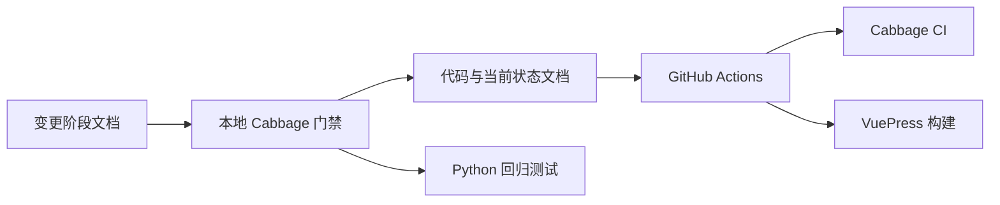

# Context

## Current State

项目已经实现 `cabbage` CLI、模板、工作流和质量门禁，但自身此前没有 `.cabbage/` 项目配置、结构化当前状态文档或仓库级文档 CI。此次自举只把现有能力应用到本仓库，不修改 CLI 行为。当前 `.git` 元数据无效，因此 Git diff 相关检查和远程分支保护不在本地可验证范围内。

## Goals and Non-goals

- Goal: 建立由 `.cabbage/` 变更状态、`docs/` 当前状态资料和 `.github/workflows/cabbage.yml` 自动校验共同组成的项目文档治理闭环。
- Non-goal: 不修改 CLI 实现、不引入新的文档框架、不修复 Git 元数据，也不配置远程仓库分支保护。

# Requirements

| ID | Technical requirement | Source |
|---|---|---|
| TR-1 | `.cabbage/config.yaml` 必须启用代码变更绑定和当前状态文档检查 | PRD R-1、R-4 |
| TR-2 | 自举 change 的影响矩阵必须与 `change.yaml` 一致 | PRD R-4 |
| TR-3 | `docs/` 必须使用初始化生成的 VuePress 配置，并通过 pnpm 管理构建依赖 | PRD R-2、R-5 |
| TR-4 | GitHub Actions 必须运行 Cabbage CI 和文档构建；Python 回归测试作为本地发布前检查 | PRD R-3、R-5 |
| TR-5 | 验证报告不得将因无效 `.git` 而未执行的检查标记为通过 | PRD R-6 |

# Design

## Overview

`.cabbage/` 保存配置、工作流定义、项目内 CLI 工具副本以及按 change 划分的决策过程；`docs/` 保存当前有效的项目知识；本地 `cabbage complete`、`gate` 和 `validate` 负责阶段与内容门禁；`.github/workflows/cabbage.yml` 在有效 Git 托管环境中复现 Cabbage CI 和文档构建，Python 回归测试作为本地发布前验证。变更文档说明“为什么和如何变”，当前状态文档说明“现在是什么”，两者通过影响矩阵和 CI 规则保持同步。

## Interfaces and Data

不涉及 API 或业务数据变更。CLI 读取 `.cabbage/config.yaml`、工作流文件和 change 的 frontmatter/状态文件，完成阶段时记录状态，门禁根据影响项决定必需文档。核心不变量是影响矩阵与 `change.yaml` 一致、激活阶段没有未处理占位内容、受影响领域对应的当前状态文档存在。既有 `cabbage` 命令、英文契约标题和 frontmatter 字段保持兼容。

# Alternatives

| Option | Benefits | Costs and risks | Decision |
|---|---|---|---|
| 保持现状，仅维护 README | 无初始化成本，文件数量少 | 无变更追踪、阶段门禁或影响驱动的现状文档校验 | 拒绝：不能验证项目所宣称的治理能力 |
| 仅执行 `cabbage init` | 快速生成基础目录和 CI | 只有骨架，没有真实 change 和项目现状内容 | 拒绝：无法证明完整自举路径 |
| 完整自举 | 同时验证初始化、阶段文档、当前状态资料和门禁 | 初次需要编写多份文档，并受 pnpm、Git 环境约束 | 接受：覆盖目标且复用现有能力 |

# Security and Privacy

不新增运行时信任边界、权限模型或敏感数据处理。CI 配置不写入凭据，依赖 GitHub Actions 默认令牌权限。文档内容不得包含密钥、个人数据或本地环境秘密；所有提交仍受仓库原有访问控制约束。

# Observability

| Signal | Purpose | Alert or dashboard |
|---|---|---|
| `cabbage validate` 输出 | 证明 change 结构、内容和状态满足规则 | 维护者在阶段完成和合并前检查退出码与错误列表 |
| Python unittest 输出 | 证明 CLI 既有行为未因自举文件回归 | 本地发布前验证要求全部用例通过 |
| VuePress 构建输出 | 证明站点配置和 Markdown 可生成生产产物 | CI 检查 `pnpm run build` 或 `cabbage docs build` 的退出码 |
| GitHub Actions Cabbage job | 证明有效 Git diff 下的文档绑定与构建链路 | 恢复 Git 后将其设为受保护分支必需状态检查 |

# Failure Modes

| Failure mode | Detection | Handling | Recovery |
|---|---|---|---|
| 阶段文档仍含占位内容或缺少标题 | `cabbage complete` 或 `validate` 返回非零退出码并列出文件 | 阶段不允许完成，后续门禁保持关闭 | 补全文档后重新完成并校验阶段 |
| 当前状态文档与影响项不匹配 | CI 或 merge gate 报告缺少领域文档 | 合并被阻止 | 新增或更新对应 `docs/` 内容后重跑门禁 |
| pnpm 或文档依赖不可用 | 安装或 VuePress 构建命令失败 | 文档构建检查不能完成 | 提供 pnpm 环境、安装锁定依赖并重跑构建 |
| `.git` 无效 | `cabbage ci --base` 无法获得有效 diff | 不宣称 CI 和分支保护已验证 | 恢复有效 Git 元数据并连接远程后补做集成验证 |

# Rollout

先运行初始化生成 `.cabbage/`、`docs/` 和 CI 骨架，再创建自举 change，随后完成需求、影响、设计、测试、任务和发布文档，最后补充当前状态文档并执行本地门禁、Python 测试和 VuePress 构建。该变更不需要功能开关或数据迁移；成功标准是所有本地可执行检查通过，并显式记录 Git 集成验证限制。

# Rollback

若自举配置导致现有测试失败、文档无法构建或门禁规则与项目实际不符，则回退本变更新增的 `.cabbage/`、`docs/` 和 `.github/workflows/cabbage.yml` 文件。没有业务数据迁移，回退不涉及数据恢复；回退前保留本 change 文档作为问题分析材料。

# Open Questions

- N/A：技术边界已经确定。Git 集成和分支保护验证将在有效仓库环境恢复后按既定步骤补做。
