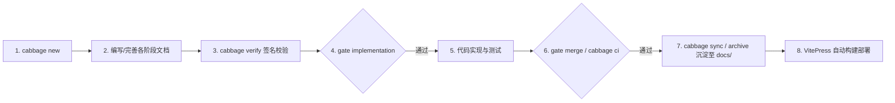

# Cabbage

<p align="center">
  <strong>面向 AI Agent 与现代软件团队的项目文档生命周期与工作流门禁系统</strong>
</p>

<p align="center">
  <a href="https://github.com/devcxl/cabbage/actions/workflows/cabbage.yml"></a>
  <a href="https://devcxl.github.io/cabbage/"></a>
  <a href="https://www.python.org/"></a>
  <a href="https://vitepress.dev/"></a>
  <a href="LICENSE"></a>
</p>

---

在线文档：[https://devcxl.github.io/cabbage/](https://devcxl.github.io/cabbage/)

核心目标不是“提醒写文档”，而是把需求（PRD）、影响分析、架构设计（RFC/ADR）、API 规范、数据库设计、测试计划和发布方案变成**可执行、可签名验证、不可篡改的 CI 刚性工作流门禁**。



---

## 核心特性

- **刚性工作流门禁**：在编写代码前强制执行 `gate implementation`，检查 PRD、影响分析与架构设计是否完备；PR 合并前强制执行 `gate merge` 与 `cabbage ci` 门禁。
- **内容签名与防腐化（Anti-Rot）**：每个阶段验证时记录依赖拓扑与内容签名（SHA-256）。一旦上游文档、工作流定义或影响矩阵发生变化，下游已验证阶段自动置为 `stale`。
- **严格占位符与死链拦截**：`verify` 自动校验 Markdown 结构，严格拒绝遗留的 `TODO`、`TBD`、`FIXME`、未勾选任务 `[ ]` 以及失效的本地链接与锚点。
- **自动同步与归档沉淀**：执行 `cabbage sync` 或 `cabbage archive` 时，自动将验证通过的变更规范萃取沉淀至 `docs/` 标准文档树，变更历史安全归档至 `.cabbage/archive/`。
- **存量文档无痛采纳（Adoption）**：提供 `cabbage adopt` 自动扫描清点项目存量文档，支持 `--apply` 一键自动归类与迁移。
- **现代化 VitePress 驱动**：开箱集成 VitePress 1.6 + Mermaid 图表，极速 Vite 编译与即时搜索，并通过 GitHub Actions 自动持续部署至 GitHub Pages。

---

## 安装方式

本项目不发布至公共 PyPI，推荐通过以下方式进行安装：

### 1. 远程一键安装（Linux / macOS，推荐）

自动创建独立隔离虚拟环境并软链至 `~/.local/bin/cabbage`（无需 root 权限，不污染全局 Python 环境）：

```bash
curl -fsSL https://raw.githubusercontent.com/devcxl/cabbage/master/scripts/install.sh | bash
```

> **卸载命令**：
> ```bash
> curl -fsSL https://raw.githubusercontent.com/devcxl/cabbage/master/scripts/install.sh | bash -s -- --uninstall
> ```

### 2. Arch Linux 原生包（AUR / PKGBUILD）

```bash
# 从仓库 PKGBUILD 本地构建安装
cd packaging/aur && makepkg -si

# 或通过 AUR Helper 安装
yay -S cabbage-git
```

### 3. Debian / Ubuntu (.deb 包)

从 [GitHub Releases](https://github.com/devcxl/cabbage/releases) 下载最新 `.deb` 安装包：

```bash
sudo dpkg -i cabbage_*_all.deb
# 如缺少依赖可执行：sudo apt-get install -f
```

---

## 快速开始

### 1. 初始化项目

```bash
cd your-project
cabbage init
```

> 如果项目已有旧文档，运行 `cabbage adopt` 进行存量盘点，或运行 `cabbage adopt --apply` 自动迁移。

### 2. 变更全生命周期操作

```bash
# 1. 环境诊断
cabbage doctor

# 2. 创建新变更（类型可选：feature, architecture, bugfix, hotfix, migration, integration, incident, refactor）
cabbage new feature add-user-login

# 3. 查看当前变更进度与就绪阶段
cabbage status add-user-login
cabbage next add-user-login

# 4. 调整影响分析矩阵（将激活或跳过对应阶段）
cabbage impact add-user-login --set api=true --set database=true

# 5. 编辑并签名验证阶段文档（自动拒绝 TODO/占位符）
cabbage verify add-user-login requirement
cabbage verify add-user-login impact
cabbage verify add-user-login design
cabbage verify add-user-login tests

# 6. 实现前门禁检查（确保所有设计与测试计划已就绪）
cabbage gate add-user-login implementation

# 7. 开始编码与完成实现任务清单（tasks.md 勾选完成）
cabbage verify add-user-login implementation

# 8. 合并前门禁检查与文档同步
cabbage validate add-user-login
cabbage sync add-user-login
cabbage gate add-user-login merge

# 9. 本地预览/构建文档站点
cabbage docs dev
cabbage docs build

# 10. 合并后归档变更
cabbage archive add-user-login
```

---

## CLI 命令速查

| 命令 | 描述 | 常用选项 |
| :--- | :--- | :--- |
| `cabbage init` | 在当前仓库初始化 Cabbage 规范、脚手架与 VitePress 站点 | `--force`, `--no-vendor-cli` |
| `cabbage doctor` | 诊断系统依赖环境（Python, PyYAML, Git, pnpm）与项目配置健康度 | `--json` |
| `cabbage adopt` | 扫描并清点现有存量文档，生成迁移分析报告 | `--apply` (自动执行迁移), `--json` |
| `cabbage new <type> <id>` | 创建指定类型的新变更工作流 | - |
| `cabbage discard <id>` | 安全废弃并删除未归档的 active 变更 | - |
| `cabbage status [id]` | 查看指定变更或全局变更的阶段完成与失效状态 | `--json` |
| `cabbage next <id>` | 计算当前依赖就绪可执行的下一个阶段 | `--json` |
| `cabbage impact <id>` | 查询或修改变更影响矩阵（如 API/数据库/安全等） | `--set field=true\|false`, `--json` |
| `cabbage verify <id> <stage>`| 验证并记录阶段签名（检查占位符、Checklist、死链与 Mermaid） | - |
| `cabbage gate <id> <target>` | 门禁卡点校验（`implementation` / `merge` / `archive`） | `--json` |
| `cabbage validate [id]` | 全量校验变更 frontmatter、标题及 Markdown 格式合法性 | `--all`, `--json` |
| `cabbage sync <id>` | 将当前变更已验证的规范文档自动同步至 `docs/` 树 | `--json` |
| `cabbage archive <id>` | 校验并通过归档门禁，将变更归档至 `.cabbage/archive/YYYY/` | - |
| `cabbage ci --base <ref>` | CI 门禁检查：基于 Git diff 强制校验代码变动是否绑定有效变更 | `--base origin/main` |
| `cabbage docs <action>` | 管理 VitePress 文档站点（`install` / `dev` / `build`） | - |

---

## 门禁落地建议（CI/CD & Governance）

1. **分支保护规则**：在 GitHub / GitLab 仓库将 CI 中的 `validate-and-test` 设为保护分支的 **Required Status Check**。
2. **策略目录保护**：通过 `CODEOWNERS` 对 `.cabbage/workflows/**`、`.cabbage/config.yaml` 及 CI 配置文件设置严格的人工审核权限。
3. **禁止绕过**：不允许 Agent 或开发者在未经文档阶段验证的情况下直接合并代码变更。详见 `references/enforcement.md`。

---

## License

[MIT](LICENSE) © devcxl
