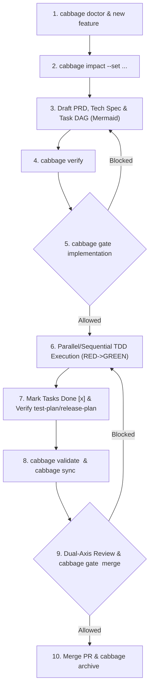

# Cabbage Skill: Project Documentation Lifecycle & Workflow Gates

## 1. When to Use & Scenario Dispatch (Phase 0)

Use this Skill whenever performing any software engineering, architecture, documentation, or operational activity.

Before beginning, classify the incoming task against the 10 scenario archetypes:

| Scenario Archetype | Cabbage Change Type | Workflow Path | Key Actions & Exit Criteria |
|---|---|---|---|
| **New Feature / Capability** | `feature` | Full Lifecycle | PRD -> Tech Spec (Testing Decisions) -> Tasks (Vertical Slices) -> Implementation -> Dual-Axis Review -> Merge |
| **Bug / Regression** | `bugfix` | Lightweight Corrective | Reproduce -> Failing Test (RED) -> Minimal Fix (GREEN) -> Regression Verify |
| **Production Incident / Hotfix** | `hotfix` / `incident` | Fast-Track Patch | Patch from release tag -> Minimal Fix -> Release PR -> Rollback plan |
| **Business Adjustment** | `feature` / `bugfix` | Change Management | Impact analysis -> Backward compatibility check -> Update spec -> Implement |
| **Refactoring** | `refactor` | Behavior-Preserving | Test safety net -> Stepwise refactor -> Differential/snapshot parity check |
| **Tech Debt Cleanup** | `refactor` | Behavior-Preserving Removal | Inventory unused assets -> Verify consumer references -> Delete -> Full regression |
| **Infrastructure Change** | `integration` / `refactor` | CI-as-Acceptance | Small incremental steps -> Push to CI -> Verify build pipeline & regression |
| **Documentation Update** | `feature` or direct docs | Docs-as-Code | Update canonical docs -> Terminology check -> Docs build verify (`cabbage docs build`) |
| **Rollback & Recovery** | `hotfix` | Controlled Rollback | Revert PR -> Create root-cause corrective change -> Clean worktrees |
| **Technical Research** | `architecture` | Evidence-Driven | Frame hypothesis -> Conduct research/POC -> Document findings & trade-offs |

- *Reference: [`references/decision-tree.md`](references/decision-tree.md) for full classification tree and impact mappings.*

---

## 2. Core Principles & Anti-Rot Rules

1. **Single Source of Truth**: Every architectural or product fact lives in exactly one canonical document; all other docs link to it.
2. **Current-State vs. Decision History**:
   - Current-state docs (`docs/01-product/`, `docs/03-architecture/system-design/`, `docs/05-api/`, `docs/13-operations/`) describe the system as it exists now and are updated in-place.
   - Decision-history docs (`ADR`, `RFC`, `postmortem`) are immutable historical records. Never rewrite history; explicitly supersede older decisions with new ones.
3. **Content Signatures & Cascading Invalidation**: Verifying an artifact computes a cryptographic SHA-256 signature of its content, workflow schema, and upstream dependencies. Modifying an upstream artifact automatically invalidates downstream stages to `stale`.
4. **Zero Placeholder & Strict Link Integrity**: Verification rejects any residual `TODO`, `TBD`, `FIXME`, or default scaffold prompts, as well as broken local relative links.
5. **Atomic PR Delivery**: Code changes and their associated documentation changes must be committed and delivered in the same Pull Request.
6. **Automated Specification Synchronization**: Running `cabbage sync` or `cabbage archive` automatically extracts verified specifications into the persistent `docs/` hierarchy.
7. **No Final-v2-Copy Anti-Patterns**: Avoid filenames like `spec-v2-final.md`. Maintain stable paths and let Git manage version history.

---

## 3. Comprehensive Reference Index & Navigation

Before or during execution, consult the following dedicated reference guides in `references/`:

| Reference Document | Scope & Key Topics | When to Consult |
|---|---|---|
| [`references/cli.md`](references/cli.md) | Complete CLI syntax, subcommands, flags, exit codes, and JSON outputs | Executing or debugging any `cabbage` command |
| [`references/decision-tree.md`](references/decision-tree.md) | 10 scenario archetypes, classification tree, impact matrix, conditional activations | Classifying a new task or configuring impact flags |
| [`references/lifecycle.md`](references/lifecycle.md) | Change states (`active` / `archived`), stage state machine, SHA-256 signatures, stale triggers | Understanding state transitions or resolving gate blocks |
| [`references/directory-structure.md`](references/directory-structure.md) | Standard 22-category `docs/` tree layout and placement rules | Locating, creating, or moving long-lived documentation |
| [`references/document-types.md`](references/document-types.md) | Specifications, Testing Decisions, DAG vertical task slices, and lifecycle rules for 12 artifact types | Writing PRD, Tech Spec, ADR, RFC, API Design, Task DAGs, etc. |
| [`references/adoption.md`](references/adoption.md) | 7-phase flow for scanning, classifying, and migrating existing repository docs | Onboarding pre-existing project documentation |
| [`references/validation.md`](references/validation.md) | Automated validation rules, TDD protocol, and Dual-Axis Review framework | Troubleshooting `verify`/`validate` or reviewing PRs |
| [`references/linking-rules.md`](references/linking-rules.md) | Relative path resolution, stable heading anchors, cross-referencing rules | Writing Markdown links between files |
| [`references/naming-conventions.md`](references/naming-conventions.md) | Kebab-case naming, ADR/RFC numbering formats (`ADR-0001-...`), anti-patterns | Naming change workspaces, ADRs, RFCs, and files |
| [`references/diagrams.md`](references/diagrams.md) | Mermaid diagram syntax templates (Flowchart, Sequence, State, ER, Class, Git) | Creating or reviewing architectural diagrams |
| [`references/documentation-site.md`](references/documentation-site.md) | VitePress 1.6+ configuration, Mermaid integration, local dev preview, static build | Previewing or compiling the `docs/` site |
| [`references/enforcement.md`](references/enforcement.md) | CI gate configuration, branch protection, CODEOWNERS, agent security boundary | Setting up CI/CD pipelines or permission policies |
| [`references/ownership.md`](references/ownership.md) | Code-to-documentation parity, frontmatter metadata, team ownership boundaries | Assigning doc maintainers and PR reviewers |

---

## 4. Standard Operating Procedures (SOPs)

### SOP 1: Feature & Capability Delivery Flow

Follow this end-to-end workflow when implementing a new feature or business capability.



#### Step 1: Initialize Workspace & Environment Check
Check environment prerequisites and initialize the change workspace:

```bash
cabbage doctor
cabbage new feature <change-id>
```
- *Reference: [`references/naming-conventions.md`](references/naming-conventions.md) for `<change-id>` naming.*

#### Step 2: Impact Analysis & Stage Activation
Evaluate affected technical domains and activate conditional stages:

```bash
cabbage impact <change-id>
cabbage impact <change-id> --set api=true --set database=true --set security=true
```
- *Reference: [`references/decision-tree.md`](references/decision-tree.md) for impact field mappings.*

#### Step 3: Author Artifacts, DAG Task Decomposition & Stage Verification
Inspect next ready stages, fill in the generated templates in `.cabbage/changes/<change-id>/`, remove all placeholders, and verify each stage:

```bash
cabbage next <change-id>
# Edit .cabbage/changes/<change-id>/prd.md
cabbage verify <change-id> prd

# Edit tech-spec.md (must include ## Testing Decisions)
cabbage verify <change-id> tech-spec

# Edit tasks.md (must define Task DAG in Mermaid, vertical slices & parallel groups)
cabbage verify <change-id> tasks
```
- **Task DAG Principles**:
  - Model tasks as a Directed Acyclic Graph (DAG) with Mermaid `flowchart TD`.
  - Slice tasks vertically (end-to-end observable behavior), avoiding horizontal tech layers.
  - Declare explicit `Blocked By` dependencies (true blocking only; no circular dependencies).
  - Identify parallelizable task groups that can be assigned concurrently to isolated developer threads/subagents in fresh contexts.
- *Reference: [`references/document-types.md`](references/document-types.md) for Testing Decisions and DAG vertical task slice standards.*  
- *Reference: [`references/diagrams.md`](references/diagrams.md) for Mermaid architectural and DAG diagram templates.*

#### Step 4: Pre-Implementation Gate Guard
Before writing source code, confirm the implementation gate passes:

```bash
cabbage gate <change-id> implementation
```
*If this command exits with non-zero or outputs `BLOCKED`, resolve missing or stale stages before touching code.*

#### Step 5: TDD Implementation & Parallel Execution Protocol
Execute tasks according to the DAG topological order:
1. **Parallel Execution**: Independent branches in the DAG can be executed concurrently by subagents or parallel worker threads without cross-contamination.
2. **Behavior-Oriented TDD Cycle**:
   - Write a failing behavioral test against the public Test Seam agreed upon in `tech-spec.md` (RED).
   - Implement the minimal code needed to pass the test (GREEN).
   - Refactor cleanly while preserving behavior (REFACTOR).
3. **Checklist Maintenance**: Update `.cabbage/changes/<change-id>/tasks.md` from `- [ ]` to `- [x]` as each vertical slice is verified.
- *Reference: [`references/validation.md`](references/validation.md) for TDD behavioral protocol and Dual-Axis Review.*

#### Step 6: Post-Implementation Verification & Plans
Complete and verify `test-plan.md` and `release-plan.md`:

```bash
cabbage verify <change-id> tasks
cabbage verify <change-id> test-plan
cabbage verify <change-id> release-plan
```

#### Step 7: Full Validation & Specification Sync
Validate all change constraints and synchronize specifications into `docs/`:

```bash
cabbage validate <change-id>
cabbage sync <change-id>
cabbage docs build
```
- *Reference: [`references/directory-structure.md`](references/directory-structure.md) for synced target paths.*  
- *Reference: [`references/documentation-site.md`](references/documentation-site.md) for VitePress build details.*

#### Step 8: Dual-Axis Review & Merge Gate
Execute Dual-Axis Review (Specification Axis + Convention Axis) and evaluate merge readiness:

```bash
cabbage gate <change-id> merge
cabbage ci --base origin/main
```
- *Reference: [`references/validation.md`](references/validation.md) for Dual-Axis Review criteria.*

#### Step 9: PR Merge & Archival
After merging the PR into the target branch:

```bash
cabbage archive <change-id>
```
- *Reference: [`references/lifecycle.md`](references/lifecycle.md) for archival mechanics.*

---

### SOP 2: Existing Project Documentation Adoption Flow

Follow this procedure when onboarding an existing repository with pre-existing documentation.

```bash
# 1. Scaffold Cabbage base without touching existing docs
cabbage init

# 2. Inventory all existing markdown documentation
cabbage adopt

# 3. Apply suggested migrations or manually resolve review rows
cabbage adopt --apply

# 4. Create adoption baseline change record
cabbage new feature adopt-existing-docs

# 5. Verify links and site build
cabbage validate adopt-existing-docs
cabbage docs build

# 6. Merge baseline PR and enable CI enforcement
```
- *Reference: [`references/adoption.md`](references/adoption.md) for the detailed 7-phase adoption guide.*  
- *Reference: [`references/enforcement.md`](references/enforcement.md) for branch protection and CI setup.*

---

### SOP 3: Architecture Change & ADR/RFC Decision Flow

Follow this procedure when introducing systemic architectural changes, new design patterns, or major dependencies.

1. **Create Architecture Workspace**:
   ```bash
   cabbage new architecture <change-id>
   ```
2. **Draft Decision Records & Proposals**:
   - Write `adr.md` following standard Context-Decision-Consequences format.
   - If broad cross-team discussion is required, draft `rfc.md`.
   - Embed Mermaid topology and sequence diagrams directly in the text.
3. **Verify Decision Artifacts**:
   ```bash
   cabbage verify <change-id> adr
   cabbage verify <change-id> tech-spec
   cabbage gate <change-id> implementation
   ```
4. **Sync to Persistent Architecture Tree**:
   ```bash
   cabbage sync <change-id>
   ```
   *This automatically registers `ADR-XXXX` under `docs/03-architecture/adr/`.*
- *Reference: [`references/document-types.md`](references/document-types.md) and [`references/naming-conventions.md`](references/naming-conventions.md).*

---

### SOP 4: Bugfix & Hotfix Flow

Follow this streamlined procedure for defect corrections.

1. **Create Bugfix / Hotfix Workspace**:
   ```bash
   cabbage new bugfix <change-id>
   # or for urgent production defects:
   cabbage new hotfix <change-id>
   ```
2. **Minimal Impact Assessment**:
   ```bash
   cabbage impact <change-id>
   ```
   *Only enable fields directly affected by the bugfix (e.g. `testing=true`).*
3. **Reproduce & Fix with TDD**:
   - Write a failing reproduction test (RED).
   - Apply minimal fix (GREEN).
   - Document root cause analysis in `tasks.md` and mark checklist items `- [x]`.
4. **Verify & Merge**:
   ```bash
   cabbage verify <change-id> tasks
   cabbage gate <change-id> merge
   ```

---

### SOP 5: Database & Data Migration Flow

Follow this procedure when adding or modifying database schemas, tables, indexes, or running data backfills.

1. **Create Migration Workspace & Set Impact**:
   ```bash
   cabbage new migration <change-id>
   cabbage impact <change-id> --set database=true --set deployment=true
   ```
2. **Author Database Design Artifact (`database-design.md`)**:
   - Define exact DDL / schema modifications.
   - Document forward migration steps and rollback procedures.
   - Include ER diagrams using Mermaid syntax.
   - Evaluate locking, zero-downtime constraints, and data safety.
3. **Verify & Execute Gate**:
   ```bash
   cabbage verify <change-id> database-design
   cabbage verify <change-id> tasks
   cabbage gate <change-id> implementation
   ```
4. **Sync & Merge**:
   ```bash
   cabbage sync <change-id>
   cabbage gate <change-id> merge
   ```

---

### SOP 6: Production Incident & Postmortem Flow

Follow this procedure to document live service outages, root cause analysis, and preventative actions.

1. **Create Incident Workspace**:
   ```bash
   cabbage new incident <incident-id>
   ```
2. **Document Incident Timeline & Postmortem**:
   - Record exact UTC timeline in `incident.md`.
   - Conduct 5-Why root cause analysis in `postmortem.md`.
   - List actionable preventative tasks with assigned owners.
3. **Verify & Archive into Incident History**:
   ```bash
   cabbage verify <incident-id> incident
   cabbage verify <incident-id> postmortem
   cabbage sync <incident-id>
   cabbage archive <incident-id>
   ```
   *Archived records permanently reside in `docs/15-incidents/`.*

---

## 5. Long-Session Context Management & Handoff

During extended execution or when switching between major phases:

1. **Context Pressure Mitigation**: When conversation history grows large or when pausing work:
   - Produce a concise handoff record under `docs/dev/handoff-<YYYY-MM-DD>.md` summarizing:
     - Current change ID and phase.
     - Completed stages and verified artifacts.
     - Active tasks in progress and immediate next step.
     - Key files created/modified.
2. **Session Resumption**:
   - Check existing changes: `cabbage status`
   - Inspect ready actions: `cabbage next <change-id>`
   - Resume directly from the next unblocked stage rather than re-scanning the entire project.

---

## 6. Command Quick Reference

```bash
# Environment & Diagnosis
cabbage doctor                                 # Diagnostic check
cabbage init                                   # Greenfield init
cabbage adopt [--apply]                        # Adopt existing docs

# Workspace & Stages
cabbage new <type> <change-id>                 # Create change workspace
cabbage status [change-id]                     # View stage progress
cabbage next <change-id>                       # View ready/blocked stages
cabbage impact <change-id> [--set k=v]         # Inspect or update impact matrix
cabbage discard <change-id>                    # Remove active change

# Verification & Gates
cabbage verify <change-id> <stage>             # Verify single artifact
cabbage validate [<change-id> | --all]         # Validate markdown & links
cabbage gate <change-id> implementation|merge  # Evaluate lifecycle gate

# Sync, Archive & CI
cabbage sync <change-id>                       # Extract specs into docs/
cabbage archive <change-id>                    # Archive completed change
cabbage ci --base <git-ref>                    # CI diff & gate runner

# Documentation Site
cabbage docs install|dev|build                 # VitePress lifecycle
```
- *Reference: [`references/cli.md`](references/cli.md) for full parameter specifications and exit codes.*

---

## 7. Troubleshooting & Common Failure Modes

| Error / Failure | Root Cause | Resolution |
|---|---|---|
| `verify: contains placeholder: ...` | File contains `TODO`, `TBD`, `FIXME`, or default template prompt text | Replace placeholder text with real content. |
| `verify: unchecked tasks remain` | `tasks.md` contains `- [ ]` unchecked checklist items | Mark completed items as `- [x]` after implementation. |
| `gate implementation: BLOCKED` | Required pre-implementation artifacts are unverified (`pending`) or `stale` | Run `cabbage next <id>` and verify unready stages with `cabbage verify`. |
| `stage status: stale` | Upstream artifact, workflow definition, or impact flag was modified | Review the artifact against updated upstream dependencies, then re-run `cabbage verify <id> <stage>`. |
| `validate: broken link ...` | A relative link in Markdown references a nonexistent file or anchor | Check relative path depth or update heading anchor slug. See [`references/linking-rules.md`](references/linking-rules.md). |
| `docs build: failed` | VitePress dead link check or unclosed code fence | Run `cabbage validate --all` to pinpoint invalid paths. |
| `ci: code modified without change` | Strict mode detected source code modifications not covered by an active change | Create or bind an active change via `cabbage new <type> <id>`. |
