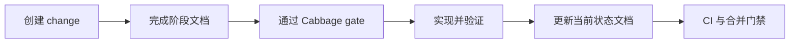

## 工作流全景

```mermaid
flowchart LR
    Change[创建 change] --> Artifacts[完成阶段文档]
    Artifacts --> Gate[通过 Cabbage gate]
    Gate --> Implement[实现并验证]
    Implement --> Current[更新当前状态文档]
    Current --> CI[CI 与合并门禁]
```
