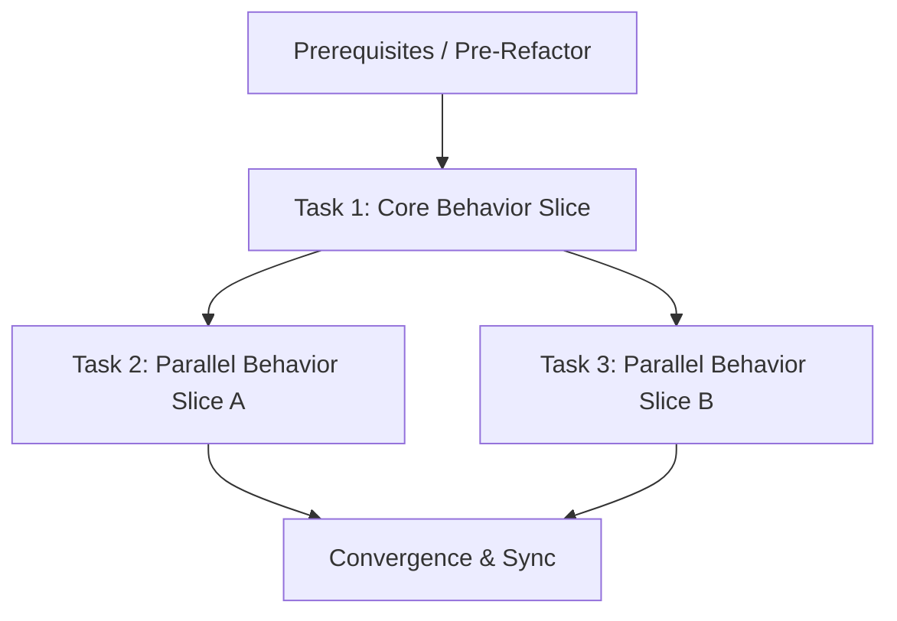

<!-- Replace every marked prompt before verifying this stage. Split work into vertical tracer-bullet tasks with an explicit DAG dependency graph and complete every checkbox. -->

# Preparation

## Parallel Execution Strategy

- **Sequential Baseline**: Prerequisites, data models, or behavior-preserving pre-refactors.
- **Parallel Slices**: Independent vertical feature slices executing concurrently in isolated contexts.
- **Convergence & Verification**: Integration tests, docs synchronization, and release checks.

- [ ] <!-- CABBAGE: Record prerequisite verification, baseline fixtures, or behavior-preserving pre-refactors. -->

# Tasks

## Task 1: <!-- CABBAGE: Primary Feature Slice Slug -->
- **Builds**: <!-- CABBAGE: Observable end-to-end user/system capability delivered by this task. -->
- **Blocked By**: None (or Preparation)
- **Parallel Group**: Group 1
- **Verification**: `<!-- CABBAGE: targeted test command -->`
- [ ] <!-- CABBAGE: Implement behavior slice 1 through public test seam. -->
- [ ] <!-- CABBAGE: Add failing test (RED) then minimal implementation (GREEN). -->

## Task 2: <!-- CABBAGE: Secondary Feature / Extension Slice Slug -->
- **Builds**: <!-- CABBAGE: Observable end-to-end capability delivered by this task. -->
- **Blocked By**: Task 1
- **Parallel Group**: Group 2
- **Verification**: `<!-- CABBAGE: targeted test command -->`
- [ ] <!-- CABBAGE: Implement behavior slice 2 through public test seam. -->
- [ ] <!-- CABBAGE: Add failing test (RED) then minimal implementation (GREEN). -->

- [ ] Add or update automated regression tests
- [ ] Update affected current-state documentation under docs/

# Verification

- [ ] <!-- CABBAGE: Record the exact test, validation, and build commands to run. -->
- [ ] Verify rollout and rollback readiness when applicable
