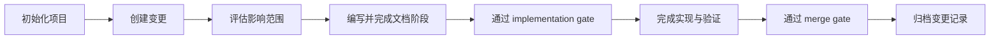

# 项目概览

Cabbage 是一个以变更为中心的文档门禁 CLI。它把需求、设计、测试、发布和事故文档纳入可验证的工作流，使文档状态能够阻止过早实现、合并或归档。

## 核心目标

- 让代码变更与对应文档在同一个变更记录中演进。
- 根据变更类型和影响范围激活必要文档，避免所有变更套用同一套清单。
- 以内容签名识别上游文档变化，并把依赖阶段自动标记为 `stale`。
- 在完成阶段拒绝空模板、错误元数据、断裂链接和未完成任务。
- 通过 CI 检查变更绑定、当前状态文档和合并门禁。

## 工作方式



典型命令序列如下：

```bash
cabbage init
cabbage new feature add-user-login
cabbage impact add-user-login --set architecture=true
cabbage next add-user-login
cabbage verify add-user-login requirement
cabbage gate add-user-login implementation
cabbage validate add-user-login
cabbage sync add-user-login
cabbage gate add-user-login merge
cabbage archive add-user-login
```

## 文档模型

Cabbage 管理三类信息：

- 当前状态文档：描述系统现在的行为，稳定存放在 `docs/` 并原地更新。
- 变更过程文档：存放在 `.cabbage/changes/<change-id>/`，记录单次变更从需求到发布的证据。
- 决策历史文档：RFC、ADR、事故报告和复盘等长期记录，通过替代或归档保留历史，不覆盖原有结论。

## 技术基线

- 运行时：Python 3.10 及以上。
- 运行依赖：PyYAML 6.0 及以上。
- 文档站点：VuePress，使用 Mermaid 渲染可审查图表。
- 自动化：GitHub Actions、Node.js 22、pnpm 10。
- 命令入口：`cabbage`，Python 模块入口为 `python -m cabbage_cli`。

## 关键目录

| 路径 | 职责 |
| --- | --- |
| `cabbage_cli/` | CLI、工作流核心和项目脚手架源码 |
| `cabbage_cli/assets/templates/` | 变更文档模板 |
| `cabbage_cli/assets/workflows/` | 各类变更的阶段定义 |
| `.cabbage/changes/` | 活跃变更及其状态 |
| `.cabbage/workflows/` | 当前项目采用的工作流 |
| `.cabbage/archive/` | 已归档的变更历史 |
| `.cabbage/tooling/` | 供项目和 CI 使用的 vendored CLI |
| `docs/` | 当前状态文档和 VuePress 站点 |

## 边界

Cabbage 负责验证文档契约和工作流状态，不替代人工评审。模板是否被填写只能证明结构完整、占位已处理；内容是否正确、方案是否合理，仍需代码所有者和领域负责人审核。
