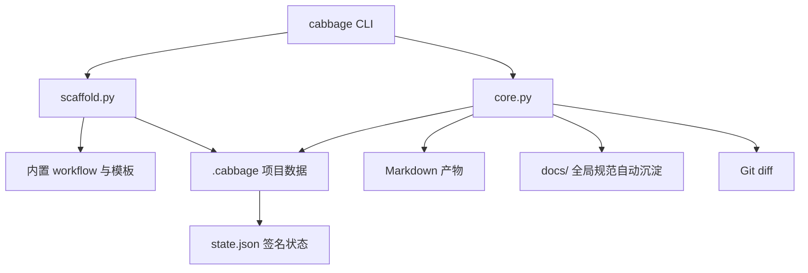

# 架构说明

Cabbage 采用单进程、文件系统驱动的 CLI 架构。工作流定义、变更规格、Markdown 产物和签名状态共同构成事实来源，不依赖数据库或远程服务。

## 模块职责

| 模块 | 职责 |
| --- | --- |
| `cabbage_cli/cli.py` | 命令解析、输出格式和退出码；连接用户操作与领域函数 |
| `cabbage_cli/core.py` | 配置读取、阶段计算、签名、Markdown 校验、门禁、Git diff 与 CI 规则 |
| `cabbage_cli/scaffold.py` | 初始化项目、复制内置资源、创建变更、渲染模板和同步影响矩阵 |
| `cabbage_cli/assets/workflows/` | 八类变更的阶段、依赖、条件和文档契约 |
| `cabbage_cli/assets/templates/` | 变更产物模板及完成态占位标记 |

## 运行流程

`cabbage init` 将工作流复制到 `.cabbage/workflows/`，并默认把 `cabbage_cli` vendoring 到 `.cabbage/tooling/`。因此 CI 可以直接使用仓库内工具版本，而不依赖预先发布的 Python 包。

## 数据与目录模型

每个活跃变更位于 `.cabbage/changes/<change-id>/`：

- `change.yaml`：变更 ID、类型、状态和十项影响字段。
- Markdown 产物：由所选 workflow 的阶段定义决定。
- `state.json`：已完成阶段的签名和完成时间，由 CLI 写入。

项目级配置位于 `.cabbage/config.yaml`；工作流位于 `.cabbage/workflows/`；完成全部阶段的变更移动到 `.cabbage/archive/<year>/`。

## 状态与签名

阶段签名由以下内容的 SHA-256 摘要组成：

- 当前 workflow 文件内容；
- 阶段定义及其条件上下文；
- 当前阶段产物内容；
- 所有已启用依赖阶段的递归签名。

已记录签名与当前签名一致时阶段为 `done`；任一输入变化后阶段为 `stale`。该机制让上游需求或设计变更自然传播到下游测试与实现阶段。

## 文档质量门禁

验证阶段（`verify`）时，核心校验器检查：

- 产物存在，且 frontmatter 中的 `change` 和 `cabbage_stage` 正确；
- workflow 声明的必需标题存在；
- 正文不含 `TODO`、`TBD`、`FIXME`、`CABBAGE` 提示或兼容的旧模板占位内容；
- 本地 Markdown 链接不越出项目根目录且目标存在；
- Mermaid 代码围栏闭合；
- `implementation` 清单存在且没有未勾选任务。

验证通过后，可随时通过 `cabbage sync` 将阶段规范同步沉淀至 `docs/`，或在 `cabbage archive` 时由 CLI 自动完成同步沉淀。

## 门禁边界

- `implementation` 检查实现阶段之前的所有已启用阶段。
- `merge` 和 `archive` 检查全部已启用阶段。
- `ci` 在 Git diff 基础上检查代码变更是否绑定活跃变更，并按影响范围要求更新相应当前状态文档。

核心运行依赖仅为 Python 3.10+ 与 PyYAML。VuePress、Mermaid、Node.js 和 pnpm 只服务于文档站点预览与构建，不进入 CLI 的核心执行路径。
