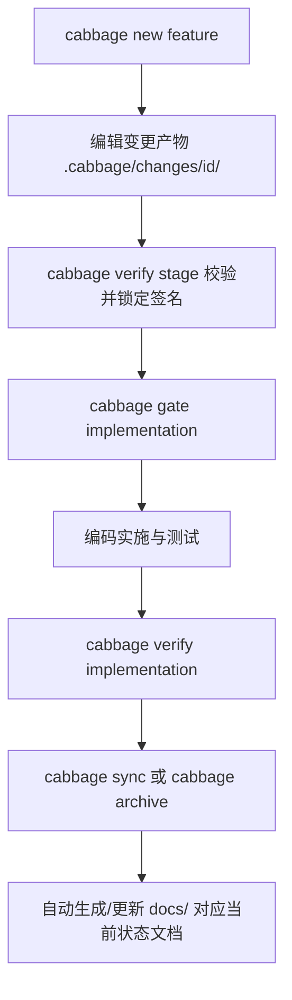

# Context

## Current State

Cabbage 原先使用 `complete` 命令对阶段产物进行验收打卡，容易与“完成整个变更”产生语义歧义；且变更完成后需要人工将规范拷贝到 `docs/` 对应的当前状态目录，存在维护负担。

## Goals and Non-goals

- Goal: 提供清晰的 `verify` 阶段验收语义，并在 `cabbage sync` 与 `cabbage archive` 时实现规范的自动映射与沉淀。
- Non-goal: 不改变底层哈希签名算法与目录分层结构。

# Requirements

| ID | Technical requirement | Source |
|---|---|---|
| TR-1 | 实现 `verify_stage` 取代 `complete_stage`，更新状态为 `verified` 并生成签名。 | PRD R-1 |
| TR-2 | 实现 `STAGE_DOCS_MAPPING` 映射表与 `sync_change_to_docs` 沉淀逻辑。 | PRD R-2 |
| TR-3 | 在 `cmd_archive` 中集成自动同步逻辑。 | PRD R-3 |

# Design

## Overview

工作流与沉淀架构如下：

## Interfaces and Data

- CLI 新增子命令：`verify <change> <stage>` 与 `sync <change>`。
- `STAGE_DOCS_MAPPING` 提供 stage 到 `docs/0x-*/` 目标路径的格式化模板。
- 同步后的文档在 Frontmatter 中携带 `origin_change`、`cabbage_stage` 与 `synced_at` 元数据。

# Alternatives

| Option | Benefits | Costs and risks | Decision |
|---|---|---|---|
| 保持 `complete` 别名 | 零迁移成本 | 保留了语义歧义 | 拒绝，按明确需求不做向后兼容，彻底统一为 `verify` |
| 全面替换为 `verify` | 语义精确，与 OpenSpec 体验一致 | 需更新测试与文档 | 采用 |

# Security and Privacy

无新增安全风险，仅操作项目内本地 Markdown 与 YAML/JSON 文件。

# Observability

| Signal | Purpose | Alert or dashboard |
|---|---|---|
| CLI 标准输出 / 错误码 | 指示验证成功、失败原因与门禁状态 | 开发者终端 / CI 执行日志 |

# Failure Modes

| Failure mode | Detection | Handling | Recovery |
|---|---|---|---|
| 阶段包含占位符未填 | `cabbage verify` 抛出 `placeholder content remains` | 阻止进入下一阶段并返回退出码 2 | 完善文档后重新执行 `verify` |
| 目标同步路径权限不足 | `sync_change_to_docs` 抛出文件系统异常 | 中止归档流程，保持变更工作区完整 | 修复权限后重试 |

# Rollout

修改源码 `cabbage_cli/`，同步更新 `.cabbage/tooling/` 副本，运行全套回归测试后更新文档。

# Rollback

通过 Git 还原受影响文件。

# Open Questions

- N/A（无遗留未决技术问题）。
