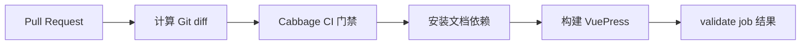

# CI/CD

当前仓库通过 GitHub Actions 在每个 Pull Request 上执行 Cabbage 变更门禁和 VuePress 文档构建；它验证合并条件，但不自动发布 Python 包或部署文档站点。

## Pull Request 流水线

工作流文件为 `.github/workflows/cabbage.yml`，包含一个 `validate` job：

1. 使用完整历史检出仓库，以便计算与目标分支的差异。
2. 配置 Python 3.12 并安装 PyYAML。
3. 从 `.cabbage/tooling/` 运行 vendored CLI：

   ```bash
   PYTHONPATH=.cabbage/tooling python -m cabbage_cli ci --base origin/<base-branch>
   ```

4. 配置 pnpm 10 和 Node.js 22。
5. 在 `docs/` 下以冻结锁文件安装依赖并运行 VuePress 构建。



## Cabbage CI 检查

项目配置当前启用了两项严格规则：

- `require_change_for_code: true`：代码变化必须同时修改一个仍存在的 `.cabbage/changes/<id>/` 记录。
- `require_current_state_docs: true`：活跃变更中设为 `true` 的影响领域，必须在配置映射的 `docs/` 目录下有对应修改。

对于本次 diff 中出现的活跃变更，CI 还会运行结构校验和 `merge` 门禁。若活跃变更记录被直接删除而未进入归档目录，检查同样失败。

## 文档构建

文档站点使用 VuePress、默认主题和 Vite bundler，官方 `@vuepress/plugin-markdown-chart` 提供 Mermaid 支持，`sass-embedded` 提供默认主题所需的 SASS 预处理器。可在本地复现 CI 构建：

```bash
cabbage docs install
cabbage docs build
```

## 强制执行条件

GitHub Actions 成功并不等同于已强制门禁。仓库管理员需要在受保护分支中把 `cabbage / validate` 配置为 Required Status Check，并对 `.cabbage/workflows/`、`.cabbage/tooling/` 和 CI 配置设置必要的人工审核。

## 当前边界

- 现有工作流未执行 `python -m unittest`，单元测试仍需在开发验证中单独运行。
- 现有工作流只构建文档，不上传构建产物或部署站点。
- 现有工作流不构建或发布 Python wheel，也不创建版本或 Release。
