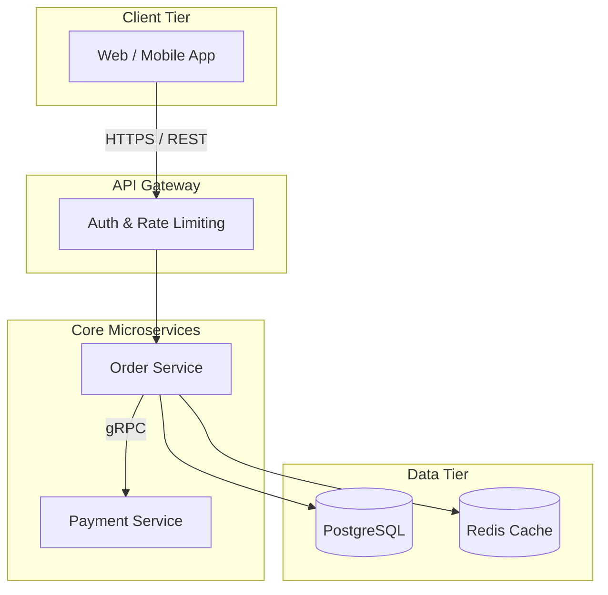
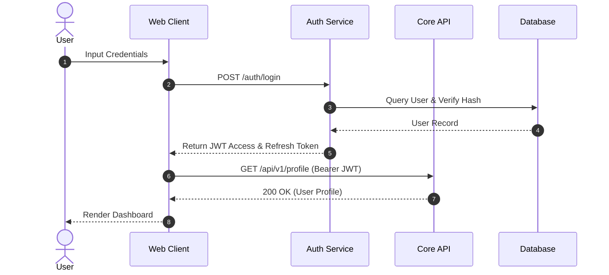
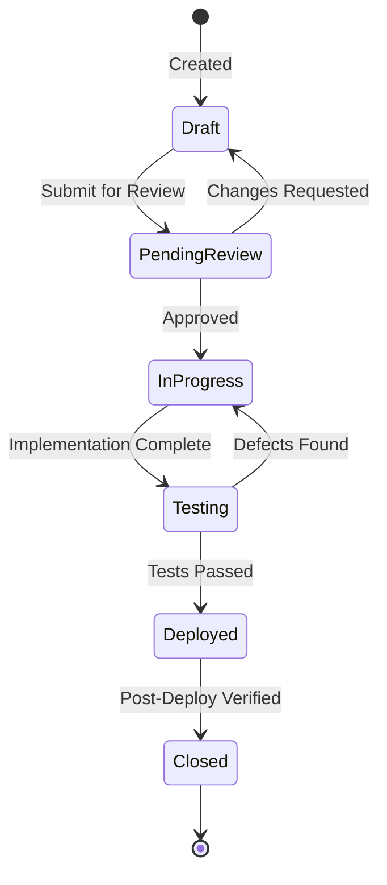
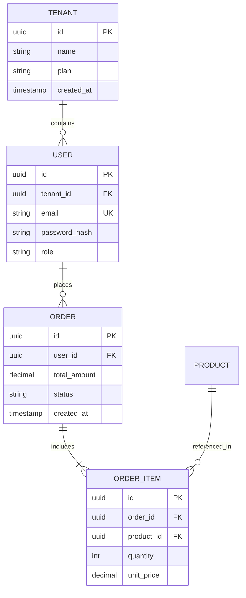
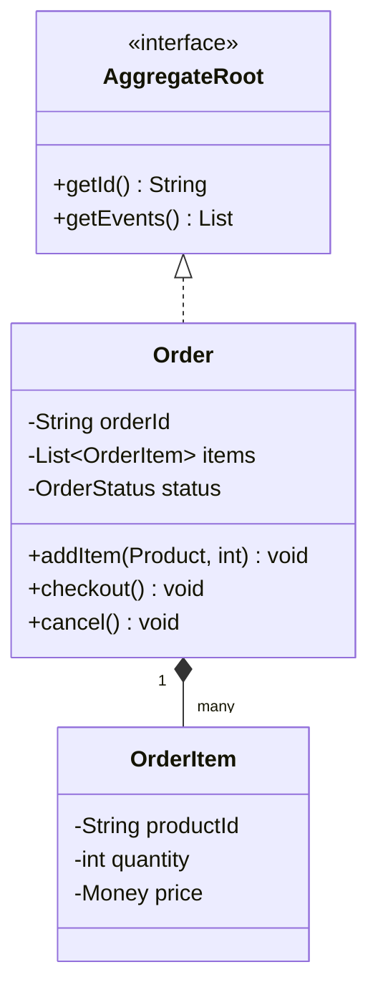
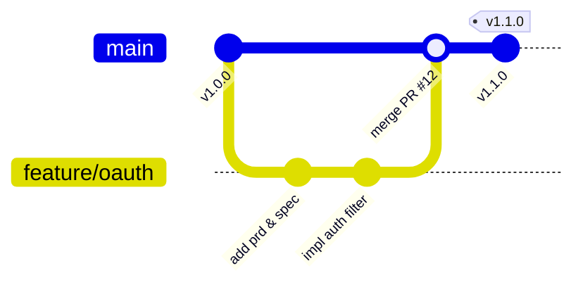

# Mermaid Diagram Guidelines & Templates

Mermaid is the official standard for architecture, flow, state, and data relationship diagrams in Cabbage. Diagrams live directly inside Markdown files to enable version tracking and peer review in PRs.

---

## 1. General Principles

1. **Keep Sources in Markdown**: Always write diagrams using ```mermaid fences. Never commit binary images (PNG/JPEG) as the sole source of truth for architectural diagrams.
2. **Text-First & Legible**: Keep node labels concise. Use subgraphs to group bounded contexts or microservices.
3. **Verify Rendering**: Always test diagrams locally via `cabbage docs dev` or during CI builds.

---

## 2. Standard Diagram Templates

### Flowchart (Process & Data Pipelines)



---

### Sequence Diagram (Call Chains & Protocols)



---

### State Diagram (State Machines & Lifecycles)



---

### ER Diagram (Database Schemas & Relationships)



---

### Class Diagram (Domain Models & Domain-Driven Design)



---

### Git Graph (Branching Strategy & Releases)


