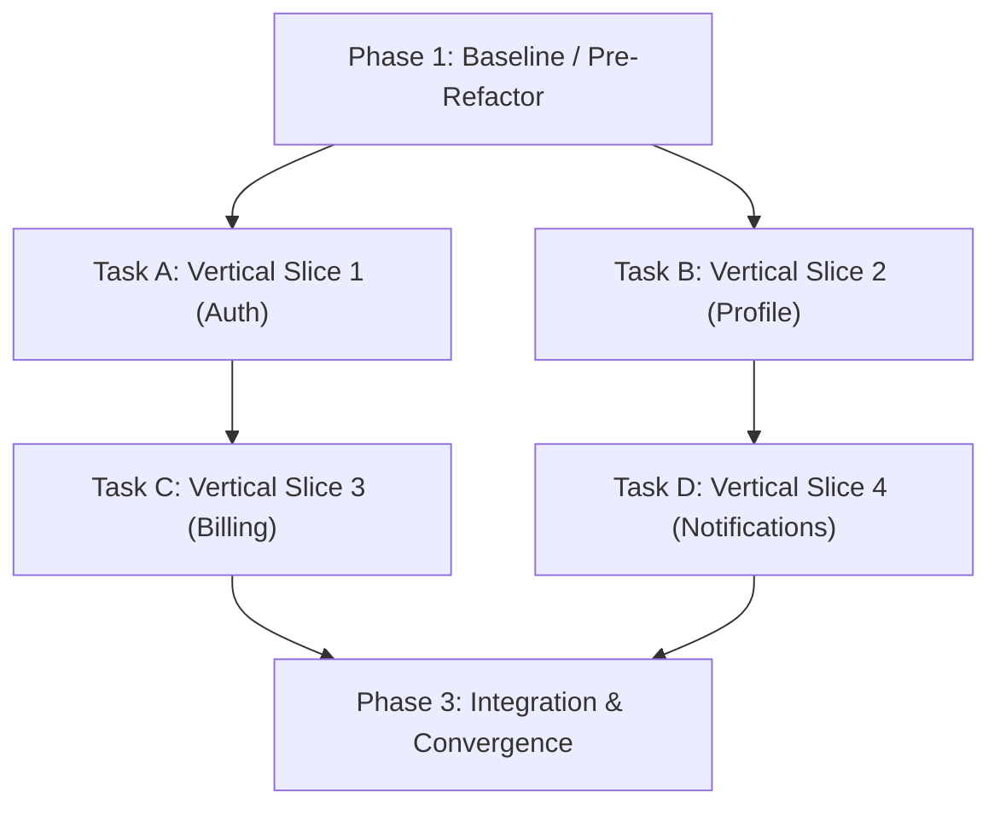

# Document Types & Template Specifications

This reference specifies the purpose, required sections, structural rules, DAG task breakdown standards, and anti-rot criteria for every document type managed by Cabbage.

---

## 1. Document Specification Matrix

| Document | Purpose | Target Path | Required Headings | Lifecycle Rule |
|---|---|---|---|---|
| **PRD** (`prd.md`) | Product vision, user stories, functional scope, acceptance criteria | `.cabbage/changes/<id>/prd.md` -> `docs/01-product/` | `## Background & Goals`, `## User Stories`, `## Functional Requirements`, `## Non-Functional Requirements`, `## Acceptance Criteria` | Current state |
| **Tech Spec** (`tech-spec.md`) | Technical architecture, component boundaries, testing decisions, failure modes | `.cabbage/changes/<id>/tech-spec.md` -> `docs/03-architecture/system-design/` | `## Context & Problem Statement`, `## Architecture & Component Design`, `## Testing Decisions`, `## Data Flow & Sequence`, `## Failure Handling & Resilience` | Current state |
| **Tasks** (`tasks.md`) | Directed Acyclic Graph (DAG) of vertical tracer-bullet tasks and checklist items | `.cabbage/changes/<id>/tasks.md` | `## Preparation`, `## Tasks`, `## Verification`, checklist items `- [ ]` | Change workspace |
| **ADR** (`adr.md`) | Architectural decision records with rationale, options, and consequences | `.cabbage/changes/<id>/adr.md` -> `docs/03-architecture/adr/ADR-<num>-<title>.md` | `## Context`, `## Decision`, `## Consequences` (Positive & Negative) | Immutable historical (supersede if changed) |
| **RFC** (`rfc.md`) | Design proposal for cross-team feedback and consensus | `.cabbage/changes/<id>/rfc.md` -> `docs/03-architecture/rfc/RFC-<num>-<title>.md` | `## Summary`, `## Motivation`, `## Detailed Design`, `## Drawbacks & Alternatives` | Immutable historical |
| **API Design** (`api-design.md`) | REST/gRPC/GraphQL endpoints, request/response models, error codes | `.cabbage/changes/<id>/api-design.md` -> `docs/05-api/` | `## Overview`, `## Endpoints / Schema`, `## Authentication & Headers`, `## Error Codes & Handling` | Current state |
| **Database Design** (`database-design.md`) | Schema changes, indexes, constraints, migration & rollback steps | `.cabbage/changes/<id>/database-design.md` -> `docs/04-data/database-design/` | `## Schema Changes`, `## Indexes & Constraints`, `## Migration Strategy`, `## Rollback & Data Safety` | Current state |
| **Security Review** (`security-review.md`) | Threat modeling, permission boundaries, PII, secrets handling | `.cabbage/changes/<id>/security-review.md` -> `docs/09-security/` | `## Attack Surface & Threat Model`, `## Authentication & Authorization`, `## Sensitive Data & Encryption`, `## Mitigations` | Current state |
| **Test Plan** (`test-plan.md`) | Test matrix, test seam verification, regression & non-functional coverage | `.cabbage/changes/<id>/test-plan.md` -> `docs/08-testing/` | `## Test Strategy & Scope`, `## Test Cases & Scenarios`, `## Regression & Non-Functional Testing` | Change workspace |
| **Release Plan** (`release-plan.md`) | Deployment ordering, environment config, verification, rollback triggers | `.cabbage/changes/<id>/release-plan.md` -> `docs/12-release/` | `## Deployment Sequence`, `## Configuration & Environment`, `## Verification Steps`, `## Rollback Procedure` | Change workspace |
| **Runbook** (`runbook.md`) | Actionable step-by-step operational and troubleshooting guide | `docs/13-operations/runbooks/` | `## Overview`, `## Prerequisites`, `## Step-by-Step Execution`, `## Verification`, `## Troubleshooting & Rollback` | Current state |
| **Incident Postmortem** (`postmortem.md`) | Post-incident analysis, 5-Why root cause, systemic corrective actions | `.cabbage/changes/<id>/postmortem.md` -> `docs/15-incidents/` | `## Summary & Impact`, `## Timeline`, `## Root Cause (5-Why Analysis)`, `## Corrective & Preventative Actions` | Immutable historical |

---

## 2. Deep Module & Testing Decisions Standards (Tech Spec)

Technical specifications must describe verifiable, testable system boundaries using the following design language:

- **Module**: A bounded component with a clear Interface and Implementation.
- **Interface**: The minimal contract required to use the Module (inputs, outputs, errors, side effects).
- **Test Seam**: A public interface boundary where behavior is observed or replaced during testing.
- **Depth**: A module is deep when its Interface is small and simple, but encapsulates significant complexity behind it. Avoid shallow "pass-through" layers.
- **No Mock-Driven Abstractions**: Do not introduce interfaces or adapter layers solely to facilitate unit test mocking when only a single production implementation exists.

### Mandatory `## Testing Decisions` Section

Every non-trivial `tech-spec.md` must declare:
1. **Target Behavior**: The specific capability or requirement to verify.
2. **Public Test Seam**: The exact public interface or entry point used to exercise the behavior.
3. **Observable Outcome**: The expected return value, state change, or output.
4. **Test Level**: Unit (isolated module), Integration (multi-module seam), or End-to-End.

---

## 3. DAG Task Breakdown & Parallel Execution Standards (Tasks)

Task breakdown in `tasks.md` translates the technical specification into an executable **Directed Acyclic Graph (DAG)** of vertical tracer-bullet tasks.

### Core Principles of DAG Task Decomposition

1. **Vertical Tracer-Bullet Slices**:
   - Each task delivers an end-to-end observable capability traversing all required technical layers (e.g. storage, logic, API, UI).
   - Never split tasks horizontally by technology layers (e.g. avoid `create-table` -> `write-service` -> `write-controller`).
2. **Directed Acyclic Graph (DAG) Dependencies**:
   - Every task explicitly specifies its prerequisites via `Blocked By: <Task ID | None>`.
   - **True Blocking Only**: A task must depend on another task *only* if it cannot physically or logically start before the predecessor finishes.
   - **Strictly Acyclic**: Circular dependencies (`A -> B -> A`) are strictly prohibited.
3. **Maximizing Parallel Execution**:
   - Tasks residing in independent branches of the DAG can and should be executed in parallel (e.g. by isolated subagents or developer threads in fresh contexts).
   - Tasks must define isolated `Verification Command`s so each parallel slice can be tested without waiting for unrelated branches.
4. **Self-Contained Fresh Context**:
   - A developer or agent should be able to pick up an unblocked task and execute it with only the Task Contract, Design Specification, and repository codebase—without needing the entire conversational history.
5. **Behavior-Preserving Pre-Refactor**:
   - When existing code structure blocks a clean vertical slice, an explicit Pre-Refactor task may be created as an initial blocking node.
   - Pre-refactors must preserve existing behavior (proven by green regression tests), avoid speculative frameworks, and focus solely on removing the immediate structural obstacle.

### Task Anti-Patterns

| Anti-Pattern | Bad Example | Correct Approach |
|---|---|---|
| **Horizontal Layering** | Task 1: Add DB migration -> Task 2: Implement Service -> Task 3: Add API controller | Task 1: Complete end-to-end vertical slice (e.g. `create-and-persist-session`) |
| **Separating Tests** | Task 1: Write feature code -> Task 2: Write tests in separate PR | Tests are written and delivered alongside the behavior slice (TDD cycle) |
| **False Dependencies** | Task B depends on Task A just because they touch the same directory | Only declare `Blocked By` when Task B cannot be compiled, run, or verified without Task A |
| **Hollow / Stub Tasks** | Task 1: Create interface and placeholder methods for future tasks | Every task must leave the codebase in a fully working, compilable, and tested state |
| **Artificial Over-Splitting** | Splitting a single cohesive 20-line CRUD into 4 separate tasks | Keep cohesive, narrow changes as a single verifiable task |

---

## 4. Anti-Rot & Verification Rules

1. **No Placeholders**: Never leave `TODO`, `TBD`, `FIXME`, or default scaffold placeholder text in any document. `cabbage verify` strictly fails on placeholder detection.
2. **Checked Tasks for Merge**: All `- [ ]` checkboxes in `tasks.md` must be marked as completed (`- [x]`) before `cabbage gate <change> merge` can pass.
3. **Immutable vs. Current-State**:
   - Current-state docs are updated in-place to reflect reality.
   - Historical records (`ADR`, `RFC`, `Postmortem`) must never be edited retroactively; write a new ADR/RFC that explicitly supersedes the prior record.
4. **Mermaid Diagrams**: Architectural flow, state, DAG, and sequence diagrams must use Mermaid code blocks rather than static image assets.
