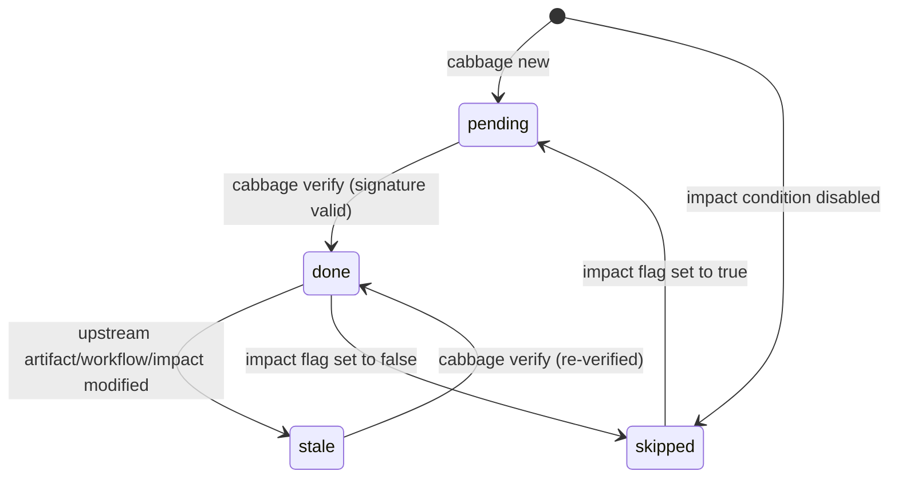

# Change & Artifact Lifecycle Management

This document details the lifecycle stages, state transitions, cryptographic signatures, cascading invalidation, and persistent synchronization in Cabbage.

---

## 1. Change Lifecycle States

A change progresses through two top-level states:

```text
[ active ] ─── (implementation & verification) ───► [ gate: archive ] ───► [ archived ]
```

- **Active**: Workspace located at `.cabbage/changes/<change-id>/`. Work is actively planned, designed, implemented, and verified.
- **Archived**: Workspace moved to `.cabbage/archive/<YYYY>/<change-id>/`. The change is permanently closed, immutable, and synchronized into `docs/`.

---

## 2. Stage State Machine

Each workflow stage inside a change has one of four derived states:



### Stage State Definitions

| State | Meaning | Trigger / Resolution |
|---|---|---|
| `pending` | Artifact created from template, not yet verified | Fill in artifact content, remove placeholders, and run `cabbage verify` |
| `done` | Artifact verified; SHA-256 signature and dependency signatures match | Stable state; ready for downstream stages or gate checks |
| `stale` | Previously verified, but invalidated due to upstream changes | Re-review artifact in light of upstream changes, then run `cabbage verify` |
| `skipped` | Deactivated by the impact analysis matrix | Controlled via `cabbage impact <change> --set <field>=false` |

---

## 3. Cryptographic Signature & Cascading Invalidation (Anti-Rot)

To prevent documentation from rotting or going out of sync with code and design:

1. **Content Signature**: When `cabbage verify <change> <stage>` runs, Cabbage computes the SHA-256 hash of the artifact content, the workflow stage schema, and all upstream dependency signatures.
2. **Recorded in `state.json`**: The signature is saved into `.cabbage/changes/<change-id>/state.json`.
3. **Cascading Invalidation**: If an upstream stage (e.g. `prd` or `impact`) is edited:
   - The upstream stage's hash changes.
   - All dependent downstream stages (e.g. `tech-spec`, `tasks`) automatically evaluate to `stale`.
   - Gate checks (`gate implementation`, `gate merge`) will block until the stale stages are re-verified.

---

## 4. Specification Synchronization (`cabbage sync`)

Specifications produced during a change are synchronized into persistent, long-lived documentation:

- **Sync Targets**:
  - `api-design.md` -> `docs/05-api/`
  - `database-design.md` -> `docs/04-data/database-design/`
  - `adr.md` -> `docs/03-architecture/adr/`
  - `rfc.md` -> `docs/03-architecture/rfc/`
- **When to Sync**:
  - Before pull request merge (`cabbage sync <change>`)
  - Automatically executed during `cabbage archive <change>`

---

## 5. Gate Enforcement Milestones

| Gate Target | Enforced Conditions | Next Permitted Action |
|---|---|---|
| `cabbage gate <change> implementation` | `prd`, `impact`, `tech-spec`, `adr`, `database-design`, `tasks` (all pre-implementation stages) are `done` | Begin writing source code and tests |
| `cabbage gate <change> merge` | All active stages (`test-plan`, `release-plan`, `tasks` with all items `[x]`) are `done`, no `stale` stages | Open / Merge Pull Request |
| `cabbage gate <change> archive` | Change fully merged to target branch, all workflow stages `done` | Run `cabbage archive <change>` |
