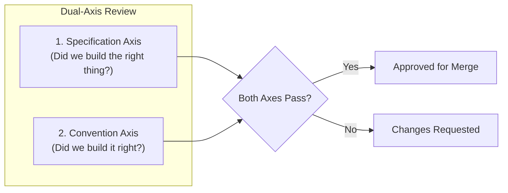

# Document, Code & Workflow Validation Standards

This reference outlines the multi-tier validation architecture in Cabbage, including automated CLI validation, TDD behavioral testing protocols, and the Dual-Axis Review framework.

---

## 1. Automated CLI Validation Pipeline

When `cabbage verify <change> <stage>` or `cabbage validate` runs, the CLI enforces:

### Structural & Frontmatter Integrity
- Frontmatter contains valid `change` and `stage` identifiers.
- All mandatory headings defined in the workflow template exist in the file.
- File is valid UTF-8 encoded Markdown.

### Content Completeness & Quality
- **Zero Placeholders**: No residual `TODO`, `TBD`, `FIXME`, or default scaffold prompts.
- **Completed Tasks**: In task-oriented stages (`tasks.md`), all checklist items must be checked (`- [x]`). Unchecked items (`- [ ]`) strictly fail verification.
- **Diagram Syntax**: All ```mermaid fences are properly closed and valid.

### Link & Reference Integrity
- Local file links resolve to real paths in the repository.
- Anchor tags (`#heading-slug`) correspond to valid section titles.

### Cryptographic Signatures
- Upstream dependencies are verified (`done`).
- Stage signature (SHA-256) matches current artifact and dependency content.

---

## 2. Test-Driven Development (TDD) Behavioral Protocol

During implementation, developers and agents should follow behavior-oriented TDD:

```text
Identify Public Test Seam & Target Behavior
                   │
                   ▼
       Write Behavior Test (RED)
                   │
                   ▼
         Minimal Implementation (GREEN)
                   │
                   ▼
    Refactor (Behavior-Preserving)
                   │
                   ▼
        Next Observable Behavior
```

### Core TDD Principles
1. **Tests are Behavioral Specifications**: Test observable outcomes through public Test Seams agreed upon in `tech-spec.md` (Testing Decisions).
2. **Implementation Decoupling**: Do not test private methods, internal call order, or invocation counts. Internal refactoring must not break behavioral tests.
3. **No Mock-Driven Architecture**: Only mock external systems at real architectural boundaries (e.g. third-party APIs). Do not introduce fake interfaces solely for mocking.
4. **Avoid TDD Anti-Patterns**:
   - *Side-channel assertion*: Bypassing public interfaces to directly inspect database records or private fields.
   - *Tautological testing*: Re-implementing the production algorithm inside the test fixture to calculate expected values.
   - *Batch horizontal testing*: Writing all tests at once before implementing code.

---

## 3. Dual-Axis Review Framework (Specification & Convention)

Code and documentation reviews must evaluate changes along two independent, non-interchangeable axes:



### Axis 1: Specification Axis (Did we build the right thing?)
- **Requirements Coverage**: Verifies that all user stories, acceptance criteria, and task items are fully satisfied.
- **Scope Creep Prevention**: Confirms that no unrequested abstractions, features, or speculative capabilities were introduced.
- **Edge Cases & Failure Modes**: Verifies boundary conditions, error handling, and timeout/resilience semantics.
- **Evidence Verification**: Verifies that every Acceptance Criterion is backed by a passing behavioral test or verifiable command.

### Axis 2: Convention Axis (Did we build it right?)
- **Architectural Depth**: Ensures modules are deep with concise interfaces, avoiding shallow pass-through layers.
- **KISS & YAGNI**: Adheres to minimal necessary complexity; eliminates speculative design.
- **Test Quality**: Confirms tests exercise behavior via public seams without implementation coupling.
- **Documentation Parity**: Confirms that API specs, DB designs, and current-state docs in `docs/` reflect code changes.

### Review Verdict Rules
- **Approved**: Both Specification and Convention axes have zero blocking findings.
- **Changes Requested**: Any blocking finding on either axis results in rejection. A pass on one axis cannot mask a failure on the other.

---

## 4. CI & Git Diff Binding (`cabbage ci`)

In CI environments, `cabbage ci --base <ref>` enforces:

1. **Change Workspace Binding**: If code files under source directories are modified in a PR, a valid matching Cabbage change workspace must exist and pass verification.
2. **Clean VitePress Build**: `cabbage docs build` must compile without errors or dead links.
3. **No Stale Stages**: All required workflow stages for active changes must be in `done` state.
