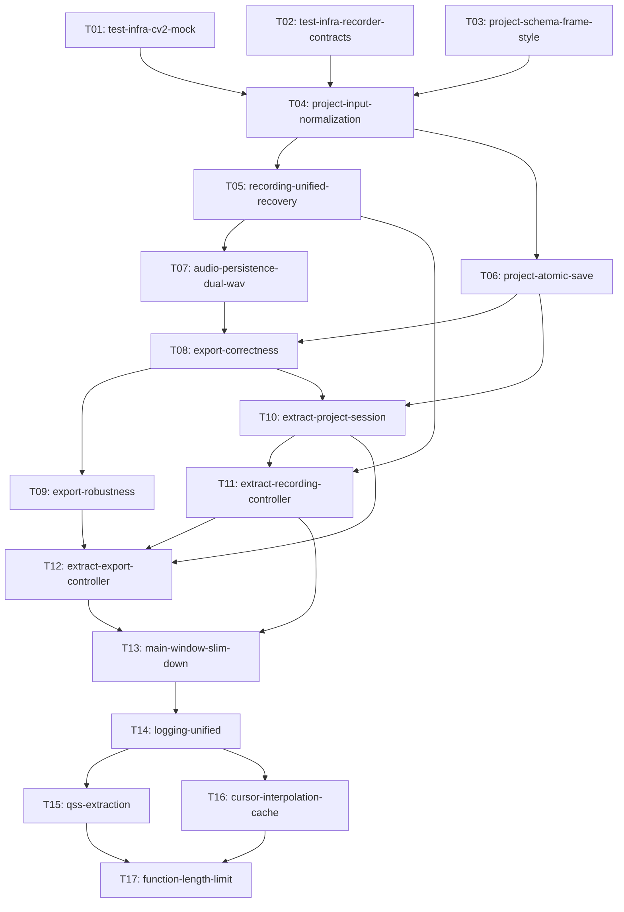

# Recordly 核心稳定性与架构治理 — 任务图

**日期：** 2026-07-16  
**Parent Issue：** #27  
**输入：**
- PRD: `docs/prd/recordly-core-stability.md`
- 技术方案: `docs/design/recordly-core-stability.md`
- ADR-007: `docs/adr/007-project-session-recording-export-controllers.md`
- 审查报告: `docs/review/core-architecture-interaction-review-2026-07-16.md`

---

## 1. DAG



---

## 2. 按拓扑 Batch 的任务表

### Batch 0: 测试基础设施恢复（3 并行任务，无文件冲突）

| Task ID | Slug | 类型 | 依赖 | 涉及文件 | 预计工时 |
|---------|------|------|------|---------|----------|
| T01 | `test-infra-cv2-mock` | test-infra | 无 | `tests/conftest.py`, `tests/test_frames_data.py`, `tests/test_screen_capture.py` | 1h |
| T02 | `test-infra-recorder-contracts` | test-infra | 无 | `tests/test_recorder.py`, `tests/test_main_window.py` | 1.5h |
| T03 | `project-schema-frame-style` | fix+refactor | 无 | `core/project.py`, `core/frame_style.py`, `tests/test_data_persistence.py` | 2h |

> **文件冲突检查：** T01 ∩ T02 = ∅, T01 ∩ T03 = ∅, T02 ∩ T03 = ∅ ✅

### Batch 1: P0 路径规范化

| Task ID | Slug | 类型 | 依赖 | 涉及文件 | 预计工时 |
|---------|------|------|------|---------|----------|
| T04 | `project-input-normalization` | fix | T01, T02, T03 | `app/main_window.py`, `core/project_manager.py`, `tests/test_main_window.py` | 2h |

### Batch 2: P0 录制基础 + 原子保存（2 并行任务，无文件冲突）

| Task ID | Slug | 类型 | 依赖 | 涉及文件 | 预计工时 |
|---------|------|------|------|---------|----------|
| T05 | `recording-unified-recovery` | fix | T04 | `app/main_window.py`, `core/recorder.py`, `tests/test_recorder.py`, `tests/test_main_window.py` | 3h |
| T06 | `project-atomic-save` | fix | T04 | `core/project.py`, `tests/test_project.py` | 2h |

> **文件冲突检查：** T05 ∩ T06 = ∅ ✅  
> （T05 修改 `main_window.py`/`recorder.py`/test 文件，T06 修改 `project.py`/test 文件，无交集）

### Batch 3: P0 音频持久化

| Task ID | Slug | 类型 | 依赖 | 涉及文件 | 预计工时 |
|---------|------|------|------|---------|----------|
| T07 | `audio-persistence-dual-wav` | feature | T05 | `app/main_window.py`, `core/recorder.py`, `core/project.py`, `tests/test_main_window.py`, `tests/test_recorder.py` | 3h |

### Batch 4: P0 导出正确性

| Task ID | Slug | 类型 | 依赖 | 涉及文件 | 预计工时 |
|---------|------|------|------|---------|----------|
| T08 | `export-correctness` | fix | T06, T07 | `core/exporter.py`, `app/main_window.py`, `tests/test_exporter.py`, `tests/test_main_window.py` | 3h |

### Batch 5: P0 导出鲁棒性 + P1 ProjectSession 提取（2 并行任务，无文件冲突）

| Task ID | Slug | 类型 | 依赖 | 涉及文件 | 预计工时 |
|---------|------|------|------|---------|----------|
| T09 | `export-robustness` | fix | T08 | `core/exporter.py`, `tests/test_exporter.py` | 3h |
| T10 | `extract-project-session` | refactor | T06, T08 | `app/project_session.py` (新), `app/main_window.py`, `core/project.py`, `tests/test_project_session.py` (新), `tests/test_main_window.py` | 4h |

> **文件冲突检查：** T09 ∩ T10 = ∅ ✅  
> （T09 修改 `exporter.py`/`test_exporter.py`，T10 修改 `project_session.py`(新)/`main_window.py`/`project.py`/新 test，无交集）

### Batch 6: P1 RecordingController 提取

| Task ID | Slug | 类型 | 依赖 | 涉及文件 | 预计工时 |
|---------|------|------|------|---------|----------|
| T11 | `extract-recording-controller` | refactor | T05, T10 | `app/recording_controller.py` (新), `app/main_window.py`, `tests/test_recording_controller.py` (新), `tests/test_main_window.py` | 4h |

### Batch 7: P1 ExportController 提取

| Task ID | Slug | 类型 | 依赖 | 涉及文件 | 预计工时 |
|---------|------|------|------|---------|----------|
| T12 | `extract-export-controller` | refactor | T09, T10, T11 | `app/export_controller.py` (新), `app/main_window.py`, `tests/test_export_controller.py` (新) | 4h |

### Batch 8: P1 MainWindow 缩减

| Task ID | Slug | 类型 | 依赖 | 涉及文件 | 预计工时 |
|---------|------|------|------|---------|----------|
| T13 | `main-window-slim-down` | refactor | T11, T12 | `app/main_window.py`, `tests/test_main_window.py` | 3h |

### Batch 9: P2 logging 统一

| Task ID | Slug | 类型 | 依赖 | 涉及文件 | 预计工时 |
|---------|------|------|------|---------|----------|
| T14 | `logging-unified` | polish | T13 | `main.py`, `core/exporter.py`, `core/compositor.py`, `core/recorder.py` | 1.5h |

### Batch 10: P2 QSS + 光标性能（2 并行任务，无文件冲突）

| Task ID | Slug | 类型 | 依赖 | 涉及文件 | 预计工时 |
|---------|------|------|------|---------|----------|
| T15 | `qss-extraction` | polish | T14 | `main.py`, `resources/style.qss` (新) | 1h |
| T16 | `cursor-interpolation-cache` | perf | T14 | `core/compositor.py`, `core/camera.py`, `tests/test_compositor.py`, `tests/test_camera.py` | 2h |

> **文件冲突检查：** T15 ∩ T16 = ∅ ✅  
> （T15 修改 `main.py`/新 `style.qss`，T16 修改 `compositor.py`/`camera.py`/test，无交集）  
> **注意：** T15 与 T14 共享 `main.py`，T16 与 T14 共享 `compositor.py`，因此 T15/T16 必须排在 T14 之后（已通过 T14→T15, T14→T16 边保证）。

### Batch 11: P2 函数长度验证

| Task ID | Slug | 类型 | 依赖 | 涉及文件 | 预计工时 |
|---------|------|------|------|---------|----------|
| T17 | `function-length-limit` | verify | T15, T16 | 按需修改本轮涉及文件中超过 50 行的函数（交叉验证） | 2h |

**总计：17 个任务，12 个 Batch，总预计工时 ≈ 42h**

---

## 3. 任务详情

---

### T01: `test-infra-cv2-mock`

| 属性 | 值 |
|------|-----|
| **Task ID** | T01 |
| **Slug** | `test-infra-cv2-mock` |
| **类型** | test-infra |
| **依赖** | 无 |
| **Parent Issue** | #27 |
| **批次** | B0 |
| **预计工时** | 1h |
| **预计文件** | 3 |

**描述：**

修复 `tests/conftest.py:33-39` 中无条件 `cv2` MagicMock 导致帧存储测试失败的问题。当前 MagicMock 使 `cv2.imencode` 返回 MagicMock 对象而非 `(success, encoded)` 元组，导致 `core/screen_capture.py:69` 解包失败。移除全局 cv2 mock，改为在需要 mock 的测试中按需注入。帧存储测试中确保真实的 `cv2.imencode`/`imdecode` 可用。

**验收标准：**

- [ ] `pytest tests/test_frames_data.py -q` 全部通过（当前 1 failed）
- [ ] `pytest tests/test_screen_capture.py -q` 全部通过（当前 1 failed）
- [ ] conftest.py 不再包含 `sys.modules['cv2'] = _cv2` 无条件 mock
- [ ] 使用 cv2 的模块在测试中通过 fixture 或模块级 monkeypatch 按需注入 mock
- [ ] 全量测试中 cv2 相关测试不再因 MagicMock 副作用失败

**输出文件：**

- `tests/conftest.py` — 移除 cv2 MagicMock
- `tests/test_frames_data.py` — 如需，添加局部 cv2 mock fixture
- `tests/test_screen_capture.py` — 如需，添加局部 cv2 mock fixture

**关联 F/US：** F1（测试基线恢复）、US-2（项目持久化验证）

---

### T02: `test-infra-recorder-contracts`

| 属性 | 值 |
|------|-----|
| **Task ID** | T02 |
| **Slug** | `test-infra-recorder-contracts` |
| **类型** | test-infra |
| **依赖** | 无 |
| **Parent Issue** | #27 |
| **批次** | B0 |
| **预计工时** | 1.5h |
| **预计文件** | 2 |

**描述：**

修复 Recorder 新增 `store_path` 参数后测试契约未更新导致的 7 个测试失败，以及 `test_playback_receives_recorded_audio_and_video_edit_map` 中缺失 `preview.set_fps()` mock。

> **注意：** FakeScreen 类不在 conftest.py 中，而在各测试文件内部定义。本任务只修改 `tests/test_recorder.py` 和 `tests/test_main_window.py`。

**具体修复：**
1. `tests/test_recorder.py` 中的 FakeScreen class 需接受 `store_path` 参数（与真实 `ScreenCapture.__init__` 签名一致）
2. Recorder 每次启动替换 `screen` 实例导致实例级 monkeypatch 失效 — 修复测试中 mock 注入时机
3. `tests/test_main_window.py` 中 `test_playback_receives_recorded_audio_and_video_edit_map` 的 Preview mock 需添加 `set_fps` 方法

**验收标准：**

- [ ] `pytest tests/test_recorder.py -q` 全部通过（当前 7 failed）
- [ ] `pytest tests/test_main_window.py::test_playback_receives_recorded_audio_and_video_edit_map -q` 通过
- [ ] FakeScreen 签名与 ScreenCapture 公共接口一致
- [ ] 无新增 skip/xfail

**输出文件：**

- `tests/test_recorder.py` — 更新 FakeScreen + 修复 7 个测试的 mock 注入
- `tests/test_main_window.py` — 添加 preview.set_fps() mock

**关联 F/US：** F1（测试基线恢复）、US-1（录制验证）、US-2（播放验证）

---

### T03: `project-schema-frame-style`

| 属性 | 值 |
|------|-----|
| **Task ID** | T03 |
| **Slug** | `project-schema-frame-style` |
| **类型** | fix+refactor |
| **依赖** | 无 |
| **Parent Issue** | #27 |
| **批次** | B0 |
| **预计工时** | 2h |
| **预计文件** | 3 |

**描述：**

修复 `test_default_values_for_legacy_project` 测试失败，并统一 `FrameStyle.bg_color` 的运行时类型与序列化格式契约。

1. **Project.load() schema 验证：** 当前 `Project.load()` 直接将 JSON 字典展开到 dataclass，旧 `CursorSettings` 的 `size/theme/color` 字段导致 `TypeError`。本任务限定当前 schema：拒绝未知字段并抛 `ValueError`（含明确错误信息），缺失 optional 字段使用 dataclass 默认值。**本轮不实现历史项目迁移**（Out-of-Scope）。
2. **测试更新：** `test_default_values_for_legacy_project` 需更新为测试当前 schema 验证行为（拒绝旧字段、接受当前格式）。
3. **FrameStyle.bg_color 统一：** 运行时类型统一为 `tuple[int,int,int]`，JSON 持久化统一为 `#RRGGBB` 字符串。`Project.save()` 边界显式 encode tuple→str，`Project.load()` 边界校验 `^#[0-9A-Fa-f]{6}$` 后 decode str→tuple。拒绝旧 `margin/radius` 等未知字段。

**验收标准：**

- [ ] `pytest tests/test_data_persistence.py -q` 全部通过（当前 1 failed）
- [ ] `pytest tests/test_project.py -q` 全部通过
- [ ] `pytest tests/test_frame_style.py -q` 全部通过
- [ ] `Project.load()` 对未知字段抛 `ValueError` 并包含字段名
- [ ] `Project.load()` 对缺失 optional 字段使用默认值
- [ ] `FrameStyle.bg_color` 运行时 `isinstance(x, tuple)` 为真，JSON 中匹配 `^#[0-9A-Fa-f]{6}$`
- [ ] 旧 CursorSettings 和 FrameStyle 未知字段被安全拒绝（当前 schema 限定）

**输出文件：**

- `core/project.py` — `Project.load()` schema 验证 + `Project.save()` bg_color encode
- `core/frame_style.py` — bg_color 类型注解和边界处理（如需）
- `tests/test_data_persistence.py` — 更新为测试当前 schema 行为

**关联 F/US：** F1（测试基线恢复）、F4（无效项目处理）、F24（FrameStyle.bg_color 统一）、US-2（项目持久化验证）

---

### T04: `project-input-normalization`

| 属性 | 值 |
|------|-----|
| **Task ID** | T04 |
| **Slug** | `project-input-normalization` |
| **类型** | fix |
| **依赖** | T01, T02, T03（需要全量测试通过作为验证基线） |
| **Parent Issue** | #27 |
| **批次** | B1 |
| **预计工时** | 2h |
| **预计文件** | 3 |

**描述：**

解决项目路径歧义问题（审查报告 HIGH §2 第 3 项）。当前 `MainWindow._on_open_project()` 将 QFileDialog 返回的 `project.json` 文件路径直接传给 `ProjectManager.open_project()`，后者拼接 `/project.json` 导致路径 `.../project.json/project.json`。

**修复范围：**
1. 在 UI/Session 边界统一将输入规范化为项目目录：`project.json` 文件路径 → `os.path.dirname()` 取父目录
2. `MainWindow._on_open_project()` 文件选择器路径和首页项目卡片路径均经过规范化
3. `MainWindow._auto_create_project()` 确保 `_current_project_path` 始终是目录路径
4. 添加回归测试：选择 `project.json` 文件能正确打开项目；打开无效目录显示明确错误

**验收标准：**

- [ ] 首页"打开项目"按钮 → 选择 `project.json` 文件 → 项目成功加载
- [ ] 首页项目卡片 → 点击卡片 → 项目成功加载
- [ ] 选择不存在的路径 → 错误提示，当前状态不变
- [ ] `_current_project_path` 始终是目录路径（无 `.json` 后缀）
- [ ] `pytest tests/test_main_window.py -q -k "open_project"` 通过
- [ ] 新增测试覆盖：文件选择器路径 → 目录规范化 → 加载成功

**输出文件：**

- `app/main_window.py` — `_on_open_project()` 路径规范化逻辑
- `core/project_manager.py` — 如需要，适配目录路径契约（但当前逻辑已正确）
- `tests/test_main_window.py` — 新增路径规范化测试 + 修复已有测试

**关联 F/US：** F3（项目输入规范化）、F4（无效项目打开）、US-2（项目持久化与重新打开）

---

### T05: `recording-unified-recovery`

| 属性 | 值 |
|------|-----|
| **Task ID** | T05 |
| **Slug** | `recording-unified-recovery` |
| **类型** | fix |
| **依赖** | T04 |
| **Parent Issue** | #27 |
| **批次** | B2 |
| **预计工时** | 3h |
| **预计文件** | 4 |

**描述：**

统一录制入口并实现完整的启动/停止失败恢复（审查报告 HIGH §2 第 4、8 项，MEDIUM §3 第 3、8 项）。

**当前问题：**
- 首页录制走 `_start_recording_from_home()` 绕过 `_on_recording_started()` 异常恢复
- 托盘录制绕过项目创建，可能覆盖旧项目或丢失录制
- `core/recorder.py` 启动失败 finally 清理可能覆盖原始异常

**修复范围（P0 阶段，不依赖 ProjectSession）：**
1. 合并首页和托盘录制入口为单一方法，参数化 `project_dir`
2. 所有入口通过现有 `ProjectManager` 目录创建逻辑生成唯一项目目录，禁止复用上一个项目路径（`_current_project_path`）
3. Recorder 启动失败：逆序清理已启动资源，重新抛原始异常
4. 录制启动失败且无帧时删除占位项目目录，恢复窗口
5. 停止失败但帧可读时保留恢复项目并恢复窗口
6. 数据不可读取时删除损坏项目并明确提示

> **P1 阶段 T11 将提取 RecordingController，届时再收敛到统一状态机对象。**

**验收标准：**

- [ ] 首页录制启动失败 → 窗口恢复、状态栏提示错误、占位项目被清理
- [ ] 屏幕采集停止时失败 → 窗口恢复、有帧时项目保留
- [ ] 托盘录制创建新项目且不修改当前已打开项目
- [ ] 录制中退出应用 → 可恢复录制数据
- [ ] `pytest tests/test_recorder.py -q` 全部通过
- [ ] 新增测试：启动失败恢复 × 2 场景、停止失败恢复 × 2 场景
- [ ] Recorder.finally 块不覆盖原始异常

**输出文件：**

- `app/main_window.py` — 合并录制入口（`_on_home_record`、`_on_tray_record`），统一恢复逻辑
- `core/recorder.py` — finally 块逆序清理 + 保留原始异常
- `tests/test_recorder.py` — 修复已有 + 新增失败恢复测试
- `tests/test_main_window.py` — 新增录制恢复流程测试

**关联 F/US：** F5（每次录制独立项目）、F6（统一状态机）、US-1（可靠录制与恢复）

---

### T06: `project-atomic-save`

| 属性 | 值 |
|------|-----|
| **Task ID** | T06 |
| **Slug** | `project-atomic-save` |
| **类型** | fix |
| **依赖** | T04 |
| **Parent Issue** | #27 |
| **批次** | B2 |
| **预计工时** | 2h |
| **预计文件** | 2 |

**描述：**

实现 `Project.save()` 原子写入，防止进程中断或磁盘写失败损坏唯一项目元数据（审查报告 MEDIUM §3 第 7 项）。

**方案：** 使用 `tempfile.mkstemp` 创建同目录临时文件，写入完整 JSON 后 `os.replace` 原子替换。写入失败时原 `project.json` 不受影响。

```python
fd, tmp_path = tempfile.mkstemp(dir=project_dir, prefix=".project-", suffix=".tmp")
try:
    with os.fdopen(fd, "w", encoding="utf-8") as f:
        json.dump(data, f, indent=2, ensure_ascii=False)
    os.replace(tmp_path, target_path)
except Exception:
    try: os.unlink(tmp_path)
    except OSError: pass
    raise
```

**验收标准：**

- [ ] `Project.save()` 使用临时文件 + `os.replace` 原子替换
- [ ] 写入过程中模拟磁盘满/权限错误 → 原 `project.json` 内容不变
- [ ] `pytest tests/test_project.py -q` 全部通过
- [ ] 新增测试：原子保存成功、写入中途失败后原文件可读
- [ ] 项目目录中不残留 `.project-*.tmp` 文件（正常流程和异常流程）

**输出文件：**

- `core/project.py` — `Project.save()` 原子写入实现
- `tests/test_project.py` — 新增原子保存测试

**关联 F/US：** F14（项目元数据原子保存）、US-2（项目持久化与重新打开）

---

### T07: `audio-persistence-dual-wav`

| 属性 | 值 |
|------|-----|
| **Task ID** | T07 |
| **Slug** | `audio-persistence-dual-wav` |
| **类型** | feature |
| **依赖** | T05 |
| **Parent Issue** | #27 |
| **批次** | B3 |
| **预计工时** | 3h |
| **预计文件** | 5 |

**描述：**

将麦克风和系统音频分别持久化为项目目录下的 WAV 文件（审查报告 HIGH §2 第 2 项）。

当前原始录音只存在于内存 `_recorded_data["audio"]`，项目保存时只持久化 `frames.data`，`SourceInfo.audio_mic` 和 `audio_system` 从未写入。重新打开项目后导出丢失音频。

**P0 方案（不依赖 ProjectSession）：**
1. 录制完成时 `MainWindow._finalize_project()` 中使用 `wave` 模块将 `_recorded_data` 中的麦克风和系统音频 numpy 数组分别写入项目目录下的 `audio_mic.wav` 和 `audio_system.wav`
2. `SourceInfo.audio_mic` / `audio_system` 写入相对路径字符串（如 `"audio_mic.wav"`），由 `Project.save()` 持久化到 `project.json`
3. 打开项目时 `MainWindow._on_open_project()` 读取 `SourceInfo` 中的 WAV 相对路径，用 `wave` 模块加载音频 numpy 数组，恢复到 `_recorded_data` 或等价播放/导出可消费的数据结构中
4. 混音不持久化 — 播放/导出时按现有规则动态混音
5. 导出流程中通过 `SourceInfo` 的 WAV 路径获取音频，替代直接访问 `_recorded_data["audio"]`

> **P1 阶段 T10 将 WAV 读写逻辑迁移到 `ProjectSession.save_audio()` / `load_audio()`，收敛音频路径所有权。**

**验收标准：**

- [ ] 录制含麦克风 + 系统音频 → 项目目录含 `audio_mic.wav` + `audio_system.wav`
- [ ] `project.json` 中 `SourceInfo.audio_mic` / `audio_system` 为有效相对路径
- [ ] 保存 → 重启 → 打开项目 → 播放有音频
- [ ] 保存 → 重启 → 打开项目 → 导出有音轨
- [ ] `pytest tests/test_main_window.py -q -k "audio"` 通过
- [ ] 新增集成测试：录制→保存→重新加载→验证音频数据一致性

**输出文件：**

- `app/main_window.py` — `_finalize_project()` WAV 写入 + `_on_open_project()` WAV 读取恢复
- `core/recorder.py` — 暴露麦克风/系统音频 numpy 数组接口（如需）
- `core/project.py` — `SourceInfo.audio_mic`/`audio_system` 在 save/load 流程中正确读写
- `tests/test_main_window.py` — 音频持久化集成测试
- `tests/test_recorder.py` — 音频数据收集接口测试

**关联 F/US：** F7（双音轨持久化）、US-2（项目持久化与重新打开）、US-3（正确导出）

---

### T08: `export-correctness`

| 属性 | 值 |
|------|-----|
| **Task ID** | T08 |
| **Slug** | `export-correctness` |
| **类型** | fix |
| **依赖** | T06, T07 |
| **Parent Issue** | #27 |
| **批次** | B4 |
| **预计工时** | 3h |
| **预计文件** | 4 |

**描述：**

修复三个导出正确性问题（审查报告 HIGH §2 第 1、7、9 项）：

**F2 — 打开项目导出崩溃：** `MainWindow._on_export()` 在 `_recorded_data is None` 时无条件执行 `self._recorded_data.get("audio")`。修复：使用 `getattr` + 默认值处理，与 `_create_playback_controller()` 保持一致。音频数据通过 T07 持久化的 WAV 文件（`SourceInfo.audio_mic`/`audio_system` 路径）加载，不再依赖 `_recorded_data`。

**F8 — 音频 source time / timeline time 分离：** `core/exporter.py` 中 `_build_audio_filtergraph` 当前将 `start_ms/end_ms` 同时用于 atrim（源裁剪）和 adelay（时间线放置）。修复：
- `atrim=start=source_start_ms/1000:end=source_end_ms/1000` — 截取源文件
- `adelay=start_ms|start_ms` — 时间线延迟放置
- 音频移动到非零播放头、裁剪头尾或变速后音画同步

**F9 — 项目 FPS 单一时间基准：** MP4 导出 `ffmpeg.input` 的 `r=` 当前使用全局 `settings.fps`，应使用 `compositor.fps`。GIF 输出帧率也统一使用 `compositor.fps`。

**验收标准：**

- [ ] 首页项目卡片 → 打开项目 → 导出不崩溃（`_recorded_data is None` 时优雅处理）
- [ ] 移动音频片段到非零播放头 → 导出音画同步
- [ ] 裁剪音频头尾 → 导出只使用裁剪后的源区间
- [ ] 变速视频 + 音频 → 导出音画同步
- [ ] 60 FPS 项目导出 → 时长 = total_frames / 60（与当前配置 FPS 无关）
- [ ] 30 FPS 项目导出 → 时长 = total_frames / 30
- [ ] `pytest tests/test_exporter.py -q` 全部通过
- [ ] 更新 `test_exporter.py:107-134` 中固化错误行为的音频测试

**输出文件：**

- `core/exporter.py` — F8 atrim/adelay 分离 + F9 compositor.fps
- `app/main_window.py` — F2 _on_export 空值处理，通过 SourceInfo WAV 路径加载音频
- `tests/test_exporter.py` — 更新音频测试 + 新增 FPS 测试
- `tests/test_main_window.py` — 新增打开项目→导出流程测试

**关联 F/US：** F2（打开项目导出）、F8（音频时间分离）、F9（项目 FPS 基准）、US-3（正确导出）

---

### T09: `export-robustness`

| 属性 | 值 |
|------|-----|
| **Task ID** | T09 |
| **Slug** | `export-robustness` |
| **类型** | fix |
| **依赖** | T08 |
| **Parent Issue** | #27 |
| **批次** | B5 |
| **预计工时** | 3h |
| **预计文件** | 2 |

**描述：**

修复导出鲁棒性问题（审查报告 HIGH §2 第 5、6 项，MEDIUM §3 第 1、4 项）：

**F10 — ExportWorker finished 保证：** `run()` 所有路径（成功、失败、取消、异常）恰好发出一次 `finished` 信号。`run()` 顶层 try/except/finally 包裹，finally 统一清理资源。

**F11 — GIF stderr drain：** GIF 路径复用 MP4 已有的 `_start_stderr_reader()`，替换当前的 `process.stderr.read()` 阻塞读。

**F12 — 取消导出清理：** 取消路径执行 `process.terminate()` → `process.wait(timeout=5)`，删除临时 WAV 和不完整输出文件。

**F13 — mktemp → mkstemp：** `core/exporter.py:403,453` 中 `tempfile.mktemp()` 替换为 `tempfile.mkstemp()`。

**验收标准：**

- [ ] FFmpeg 不存在时 → worker 发出 `finished(ExportResult(False, ...))`，线程退出，进度框关闭
- [ ] 渲染过程中 BrokenPipe → finished 信号发出，资源清理完整
- [ ] 其他未预期异常 → finished 信号发出，不挂死 UI
- [ ] GIF 大量 stderr 输出 → 不死锁，导出正常完成
- [ ] 取消导出 → 无残留 FFmpeg 进程、临时 WAV、不完整输出文件
- [ ] 全量 `tempfile.mktemp` 引用已替换为 `mkstemp`
- [ ] `pytest tests/test_exporter.py -q` 全部通过
- [ ] 新增测试：FFmpeg 不存在 × worker 结束、GIF 大量 stderr × 不死锁、取消 × 无残留

**输出文件：**

- `core/exporter.py` — run() try/except/finally 重构 + GIF stderr drain + mktemp→mkstemp + 取消清理
- `tests/test_exporter.py` — 新增鲁棒性测试

**关联 F/US：** F10（finished 保证）、F11（stderr drain）、F12（取消清理）、F13（mktemp 替换）、US-3（正确导出）

---

### T10: `extract-project-session`

| 属性 | 值 |
|------|-----|
| **Task ID** | T10 |
| **Slug** | `extract-project-session` |
| **类型** | refactor |
| **依赖** | T06, T08 |
| **Parent Issue** | #27 |
| **批次** | B5 |
| **预计工时** | 4h |
| **预计文件** | 5 |

**描述：**

从 `MainWindow` 提取 `ProjectSession` 类（ADR-007 §3.1，技术方案 §3.1.1）。

**职责：** 拥有当前项目目录、Project 模型和媒体资源路径契约。迁移以下 P0 阶段分散在 MainWindow 和 Project 模块的职责：
- 项目目录路径管理（替代 `_current_project_path`）
- 原子 JSON 保存（复用 T06 的 `Project.save()` 原子写入）
- WAV 音频文件路径管理和读写（迁移 T07 的 MainWindow WAV helper 逻辑到 `save_audio()` / 加载方法）
- `project.json` → 项目目录路径规范化（替代 T04 的路径处理逻辑）

**公开接口：**
```python
class ProjectSession:
    def __init__(self, project_dir: str)  # raises FileNotFoundError, ValueError
    project_dir: str
    project: Project
    project_file: str        # project_dir/project.json
    frames_data_path: str    # project_dir/frames.data

    @classmethod
    def create(cls, projects_dir: str, name: str) -> "ProjectSession"
    @classmethod
    def load(cls, project_dir: str) -> "ProjectSession"  # schema 验证，复用 T03

    def save(self, compositor_state, timeline_tracks, audio_regions,
             crop_region, cursor_events, click_events, monitor_offset) -> None
    def save_audio(self, mic_data, system_data, samplerate) -> None  # 迁移 T07 WAV 写入
    def load_audio(self) -> dict                                      # 迁移 T07 WAV 读取

    @staticmethod
    def normalize_path(input_path: str) -> str
```

**迁移策略：** 先加后切 — 在 MainWindow 中同时保留 `_current_project_path` 和 `_project_session`，通过 ProjectSession 读写后逐步移除直接路径操作。`_on_open_project` 使用独立临时 ProjectSession 校验后再替换（安全拒绝协议）。

**验收标准：**

- [ ] `app/project_session.py` 通过全部单元测试
- [ ] `ProjectSession.save()` 使用 T06 的原子写入
- [ ] `ProjectSession.load()` 使用 T03 的 schema 验证
- [ ] `ProjectSession.save_audio()` / `load_audio()` 正确读写项目目录下的 WAV 文件
- [ ] `ProjectSession.normalize_path()` 将 `project.json` 文件路径规范化为目录路径
- [ ] `pytest tests/test_project_session.py -q` 全部通过
- [ ] 现有 MainWindow 测试不退化（渐进引入，不破坏已有行为）
- [ ] ProjectSession 纯 Python（非 QObject），可独立测试

**输出文件：**

- `app/project_session.py` — **新增**（~180 行）
- `app/main_window.py` — 渐进引入 ProjectSession（保留旧路径兼容）
- `core/project.py` — 如需，暴露公共接口给 ProjectSession
- `tests/test_project_session.py` — **新增**（单元测试，覆盖原子保存/WAV 读写/路径规范化/schema 验证）
- `tests/test_main_window.py` — 更新以适配渐进引入

**关联 F/US：** F14（原子保存复用）、F16（ProjectSession 提取）、US-4（可维护架构）

---

### T11: `extract-recording-controller`

| 属性 | 值 |
|------|-----|
| **Task ID** | T11 |
| **Slug** | `extract-recording-controller` |
| **类型** | refactor |
| **依赖** | T05, T10 |
| **Parent Issue** | #27 |
| **批次** | B6 |
| **预计工时** | 4h |
| **预计文件** | 4 |

**描述：**

从 `MainWindow` 提取 `RecordingController`（ADR-007 §3.2，技术方案 §3.1.2）。

**职责：** 拥有录制生命周期状态机。所有录制入口（首页按钮、托盘菜单）通过 RecordingController 统一调度，复用 T05 建立的统一录制逻辑。内部使用 T10 的 `ProjectSession.create()` 创建项目目录。

**状态机：**
```
IDLE → STARTING → RECORDING → STOPPING → IDLE
                  ↓ (异常)       ↓ (异常)
               FAILED         RECOVERY
```

**公开接口：**
```python
class RecordingState(Enum):
    IDLE, STARTING, RECORDING, STOPPING = ...

class RecordingController:
    def __init__(self, config: AppConfig)
    state: RecordingState
    def start(self, project_dir: str | None = None) -> ProjectSession  # raises RecordingStartError
    def stop(self) -> dict  # raises RecordingStopError
    def set_callbacks(self, on_state_changed, on_error)
    def cleanup()
```

**迁移策略：** 替换 MainWindow 中所有直接 `recorder.start()`/`recorder.stop()` 调用为 `RecordingController.start()`/`stop()`。MainWindow 只响应 `on_state_changed` 回调更新 UI。录制失败恢复逻辑从 MainWindow 迁移到 Controller 内部。

**验收标准：**

- [ ] `app/recording_controller.py` 通过全部单元测试
- [ ] 状态机覆盖 5 种状态 × 3 种异常路径 = 15 个测试用例
- [ ] 首页录制、托盘录制均通过 RecordingController 统一入口
- [ ] 启动失败 → FAILED 状态 + 错误回调 + 项目清理与 T05 行为一致
- [ ] 停止失败 → RECOVERY 状态 + 有帧时保留项目
- [ ] `pytest tests/test_recording_controller.py -q` 全部通过
- [ ] 现有 MainWindow 录制测试不退化
- [ ] RecordingController 纯 Python（非 QObject）

**输出文件：**

- `app/recording_controller.py` — **新增**（~200 行）
- `app/main_window.py` — 替换录制入口为 RecordingController 调用
- `tests/test_recording_controller.py` — **新增**（状态机全覆盖测试）
- `tests/test_main_window.py` — 更新录制流程测试

**关联 F/US：** F17（RecordingController 提取）、US-1（可靠录制与恢复）、US-4（可维护架构）

---

### T12: `extract-export-controller`

| 属性 | 值 |
|------|-----|
| **Task ID** | T12 |
| **Slug** | `extract-export-controller` |
| **类型** | refactor |
| **依赖** | T09, T10, T11 |
| **Parent Issue** | #27 |
| **批次** | B7 |
| **预计工时** | 4h |
| **预计文件** | 3 |

**描述：**

从 `MainWindow` 提取 `ExportController`（ADR-007 §3.3，技术方案 §3.1.3）。

**职责：** 拥有 QThread + ExportWorker 生命周期管理。确保 finished 信号在所有路径恰好发出一次（复用 T09 的鲁棒性保证）；统一取消/清理协议。通过 T10 的 `ProjectSession` 获取音频数据路径和项目 FPS。

**公开接口：**
```python
class ExportController(QObject):
    export_progress = pyqtSignal(int)
    export_finished = pyqtSignal(ExportResult)

    def start_export(self, compositor, project_session, settings) -> None
    def cancel(self) -> None
    is_exporting: bool
```

**迁移策略：** 替换 MainWindow 中 `_on_export` 的 QThread 创建/信号绑定/清理为 ExportController。MainWindow 只连接 `export_finished` 信号和创建进度框。

**验收标准：**

- [ ] `app/export_controller.py` 通过全部单元测试
- [ ] `ExportController.export_finished` 在所有路径恰好发出一次
- [ ] `ExportController.cancel()` 完整执行进程终止 + 临时文件清理 + 不完整输出删除
- [ ] MainWindow._on_export() 简化为调用 `ExportController.start_export()`
- [ ] MainWindow._cancel_export() 简化为调用 `ExportController.cancel()`
- [ ] `pytest tests/test_export_controller.py -q` 全部通过
- [ ] 现有导出测试不退化

**输出文件：**

- `app/export_controller.py` — **新增**（~180 行，唯一 QObject Controller）
- `app/main_window.py` — 替换导出入口为 ExportController
- `tests/test_export_controller.py` — **新增**（finished 单次、取消清理、FFmpeg 失败）

**关联 F/US：** F15（导出清理统一）、F18（ExportController 提取）、US-3（正确导出）、US-4（可维护架构）

---

### T13: `main-window-slim-down`

| 属性 | 值 |
|------|-----|
| **Task ID** | T13 |
| **Slug** | `main-window-slim-down` |
| **类型** | refactor |
| **依赖** | T11, T12 |
| **Parent Issue** | #27 |
| **批次** | B8 |
| **预计工时** | 3h |
| **预计文件** | 2 |

**描述：**

MainWindow 从 1245 行缩减到 ≤800 行，并消除跨模块私有字段访问（技术方案 §3.2.7）。

**删除的职责（已迁移到对应 Controller）：**

| 原 MainWindow 职责 | 迁移到 |
|-------------------|--------|
| `_current_project_path` 管理 | `ProjectSession.project_dir`（T10） |
| `_auto_create_project` / `_finalize_project` | `RecordingController`（T11）+ `ProjectSession.save()`（T10） |
| 录制启动/停止 2 套入口 | `RecordingController.start()` / `stop()`（T11） |
| 导出 QThread 创建/绑定/清理 | `ExportController.start_export()`（T12） |
| `_cancel_export` | `ExportController.cancel()`（T12） |
| `_on_export_finished` 线程清理 | `ExportController.export_finished` 信号（T12） |
| `_recorder.screen._store._offsets` 访问 | 移除（通过 ProjectSession 获取） |
| `_compositor._frames/_cursor_events/_click_events` 访问 | 通过 ProjectSession 获取 |
| `_timeline._tracks` 访问 | 通过公开方法 |
| `_playback._playing/_current_frame` 访问 | 通过公开方法 |

**保留的职责：** QStackedWidget 页面切换、菜单栏/工具栏可见性、信号绑定、播放控制、时间线同步、裁剪/缩放编辑、设置对话框。

**验收标准：**

- [ ] `wc -l app/main_window.py` ≤ 800 行
- [ ] MainWindow 不直接访问 `_recorder.screen._store._offsets`
- [ ] MainWindow 不直接访问 `_compositor._frames/_cursor_events/_click_events/_clips`
- [ ] MainWindow 不直接访问 `_timeline._tracks`
- [ ] MainWindow 不直接访问 `_playback._playing/_current_frame`
- [ ] `pytest tests/test_main_window.py -q` 全部通过（不退化）
- [ ] 全量 `pytest -q` 通过

**输出文件：**

- `app/main_window.py` — 1245 → ≤800 行，移除私有字段访问
- `tests/test_main_window.py` — 更新以适配信号绑定变更

**关联 F/US：** F19（MainWindow ≤800 行）、US-4（可维护架构）

---

### T14: `logging-unified`

| 属性 | 值 |
|------|-----|
| **Task ID** | T14 |
| **Slug** | `logging-unified` |
| **类型** | polish |
| **依赖** | T13 |
| **Parent Issue** | #27 |
| **批次** | B9 |
| **预计工时** | 1.5h |
| **预计文件** | 4 |

**描述：**

统一为 Python `logging` 模块，替换分散的 `print(file=sys.stderr)` 和 `__import__()` 动态导入日志调用（审查报告 MEDIUM §3 第 2 项，技术方案 §3.2.2、§3.2.4、§3.2.8）。

**修复范围：**
1. `main.py` 添加 `logging.basicConfig`，`RECORDLY_DEBUG=1` 时 level=DEBUG 并输出到 stderr，默认 WARNING
2. `core/exporter.py` 移除 `_DEBUG` 常量和 `__import__` 动态导入，替换为 `logging.getLogger(__name__)`
3. `core/compositor.py` 移除 `compose_index()` 中每 60 帧的 stderr FPS debug 输出，替换为 `logger.debug`
4. `core/recorder.py` 中的 debug 输出替换为 logger

**验收标准：**

- [ ] `RECORDLY_DEBUG=1` 时 debug 级别日志输出到 stderr
- [ ] 默认（无环境变量）时仅 Warning/Error 输出
- [ ] `core/exporter.py` 中无 `_DEBUG` 常量
- [ ] `core/compositor.py` 中无帧计数 stderr 输出
- [ ] 无 `__import__` 动态导入
- [ ] 不输出完整用户内容或音频数据到日志

**输出文件：**

- `main.py` — `logging.basicConfig`
- `core/exporter.py` — _DEBUG → logging
- `core/compositor.py` — print → logger.debug
- `core/recorder.py` — print → logger

**关联 F/US：** F21（logging 统一）、F22（移除无条件和动态导入输出）、US-4（可维护架构）

---

### T15: `qss-extraction`

| 属性 | 值 |
|------|-----|
| **Task ID** | T15 |
| **Slug** | `qss-extraction` |
| **类型** | polish |
| **依赖** | T14 |
| **Parent Issue** | #27 |
| **批次** | B10 |
| **预计工时** | 1h |
| **预计文件** | 2 |

**描述：**

将 `main.py:9-228` 中的 `DARK_STYLESHEET` 常量（228 行内联 QSS）完整移至 `resources/style.qss`，main.py 改为文件读取。不改变任何样式规则。

**验收标准：**

- [ ] `resources/style.qss` 存在且内容与 `DARK_STYLESHEET` 完全一致
- [ ] `main.py` 中无 `DARK_STYLESHEET` 常量
- [ ] `main.py` 通过文件读取加载 QSS
- [ ] UI 视觉与之前完全一致（启动后对比截图）
- [ ] QSS 文件路径不存在时优雅降级（使用系统默认样式）

**输出文件：**

- `resources/style.qss` — **新增**（~228 行）
- `main.py` — 移除 DARK_STYLESHEET，改用文件读取

**关联 F/US：** F23（QSS 提取）、US-4（可维护架构）

---

### T16: `cursor-interpolation-cache`

| 属性 | 值 |
|------|-----|
| **Task ID** | T16 |
| **Slug** | `cursor-interpolation-cache` |
| **类型** | perf |
| **依赖** | T14 |
| **Parent Issue** | #27 |
| **批次** | B10 |
| **预计工时** | 2h |
| **预计文件** | 4 |

**描述：**

统一光标插值实现并缓存时间索引（审查报告 MEDIUM §3 第 6 项，技术方案 §3.2.4、§3.2.5）。

**修复范围：**
1. `core/compositor.py`：`_interpolate_cursor_raw()` 复用 `_interpolate_cursor()` 的二分逻辑，删除线性扫描版本
2. `core/compositor.py`：可选优化 — `load_frames_data()` 中缓存 `_frame_times` 二分索引
3. `core/camera.py`：`_interpolate()` 预计算 `_event_times: list[float]` 数组，使用 `bisect` 替代线性扫描
4. `core/camera.py`：`_calc_speed()` 复用缓存的 `_event_times`

**验收标准：**

- [ ] `_interpolate_cursor_raw()` 使用二分查找（与 `_interpolate_cursor()` 逻辑一致）
- [ ] `camera._interpolate()` 使用 `bisect` + 预计算时间数组
- [ ] `pytest tests/test_compositor.py -q` 全部通过
- [ ] `pytest tests/test_camera.py -q` 全部通过
- [ ] 光标位置和相机缩放与之前完全一致（不引入行为变更）

**输出文件：**

- `core/compositor.py` — 统一二分插值 + 缓存优化
- `core/camera.py` — bisect + 事件时间缓存
- `tests/test_compositor.py` — 添加二分查找正确性测试（如需）
- `tests/test_camera.py` — 添加缓存行为测试（如需）

**关联 F/US：** F20（统一光标插值 + 缓存时间索引）、US-4（可维护架构）

---

### T17: `function-length-limit`

| 属性 | 值 |
|------|-----|
| **Task ID** | T17 |
| **Slug** | `function-length-limit` |
| **类型** | verify |
| **依赖** | T15, T16 |
| **Parent Issue** | #27 |
| **批次** | B11 |
| **预计工时** | 2h |
| **预计文件** | ≤10（交叉验证，不新增文件） |

**描述：**

验证并修复所有新增/修改的函数不超过 50 行（PRD F25）。本任务为交叉验证 pass，不引入新功能。T15（QSS 提取）、T16（光标性能）、T14（logging）全部完成后，对所有修改文件中的函数行数做最终检查。

**验证范围：** 本轮修改的所有文件中新增或修改的函数。如发现超出 50 行的函数，拆分重构。

**验收标准：**

- [ ] 所有新增函数 ≤50 行
- [ ] 所有修改函数 ≤50 行
- [ ] 拆分重构不影响既有测试通过
- [ ] `pytest -q` 全量通过
- [ ] 最终审查无违规

**输出文件：**

- 按需修改本轮涉及的文件中的超长函数

**关联 F/US：** F25（函数 ≤50 行）、US-4（可维护架构）

---

## 4. PRD 覆盖矩阵

### F1–F25 → 任务映射

| PRD 功能 | 描述 | 优先级 | 覆盖任务 |
|---------|------|--------|---------|
| F1 | 恢复测试基线，修复 11 个失败测试 | P0 | T01, T02, T03 |
| F2 | 打开已保存项目后可正常播放和导出 | P0 | T08 |
| F3 | 项目输入在 UI/Session 边界统一规范化为项目目录 | P0 | T04 |
| F4 | 打开无效项目时当前编辑状态保持不变并显示错误 | P0 | T03, T04 |
| F5 | 每次录制都自动创建独立项目，不复用当前项目 | P0 | T05 |
| F6 | 录制启动、停止及失败恢复使用同一状态机 | P0 | T05 |
| F7 | 麦克风与系统音频分别持久化为项目内 WAV 文件 | P0 | T07 |
| F8 | 音频源裁剪区间与时间线放置时间严格分离 | P0 | T08 |
| F9 | 已有项目始终按项目原始 FPS 导出 | P0 | T08 |
| F10 | ExportWorker 所有路径恰好产生一次完成结果 | P0 | T09 |
| F11 | MP4/GIF 持续消费 FFmpeg stderr，长视频不死锁 | P0 | T09 |
| F12 | 取消导出时清理 FFmpeg、临时文件和未完成输出 | P0 | T09 |
| F13 | 使用 NamedTemporaryFile 或 mkstemp 替代 mktemp | P1 | T09 |
| F14 | 项目元数据通过临时文件 + os.replace 原子保存 | P1 | T06 |
| F15 | 统一导出进程、管道、reader thread 和临时文件生命周期 | P1 | T12 |
| F16 | 提取 ProjectSession | P1 | T10 |
| F17 | 提取 RecordingController | P1 | T11 |
| F18 | 提取 ExportController | P1 | T12 |
| F19 | MainWindow ≤800 行，不访问跨模块私有字段 | P1 | T13 |
| F20 | 统一光标插值实现并缓存时间索引 | P2 | T16 |
| F21 | 使用 Python logging，默认 WARNING；RECORDLY_DEBUG=1 开启 DEBUG | P2 | T14 |
| F22 | 移除无条件帧级/FPS stderr 输出和动态 __import__ | P2 | T14 |
| F23 | main.py 大型 QSS 移至 resources/style.qss | P2 | T15 |
| F24 | 统一 FrameStyle.bg_color 的运行时类型、序列化格式与测试契约 | P2 | T03 |
| F25 | 新增或修改的函数原则上不超过 50 行 | P2 | T17 |

**全覆盖确认：F1–F25 全部映射，无遗漏。**

### 用户故事 → 任务映射

| 用户故事 | 覆盖任务 |
|---------|---------|
| US-1：可靠录制与恢复 | T02, T05, T07, T11 |
| US-2：项目持久化与重新打开 | T01, T02, T03, T04, T06, T07 |
| US-3：正确导出 | T07, T08, T09, T12 |
| US-4：可维护架构 | T10, T11, T12, T13, T14, T15, T16, T17 |

### 审查报告问题 → 任务映射

| 审查问题 | 严重度 | 覆盖任务 |
|---------|--------|---------|
| 打开项目导出崩溃 (_recorded_data is None) | HIGH | T08 |
| 原始录音未持久化 (SourceInfo 字段未写入) | HIGH | T07 |
| project.json 文件路径与目录契约冲突 | HIGH | T04 |
| 首页录制绕过异常恢复 | HIGH | T05 |
| ExportWorker.run() 无顶层异常处理 | HIGH | T09 |
| GIF stderr 管道阻塞 | HIGH | T09 |
| 音频 source time / timeline time 混淆 | HIGH | T08 |
| 托盘录制绕过项目创建 | HIGH | T05 |
| 项目 FPS 与全局 FPS 混用 | HIGH | T08 |
| 测试基线 11 failed | HIGH | T01, T02, T03 |
| tempfile.mktemp 竞态 | MEDIUM | T09 |
| 导出 debug 永久开启 | MEDIUM | T14 |
| Recorder 启动失败 finally 覆盖异常 | MEDIUM | T05 |
| 取消/BrokenPipe 清理不统一 | MEDIUM | T09 |
| Project.load() 缺少 schema 验证 | MEDIUM | T03 |
| 光标插值实现重复 | MEDIUM | T16 |
| Project.save() 非原子写入 | MEDIUM | T06 |
| 打开新项目先清空后验证 | MEDIUM | T10（迁移至 ProjectSession.load 安全协议） |
| 停止失败窗口不恢复 | MEDIUM | T05 |
| 大型 QSS 内联 | LOW | T15 |
| 分散的 print(stderr) | LOW | T14 |
| FrameStyle.bg_color 类型不统一 | LOW | T03 |

---

## 5. 循环依赖检查

### 检查方法

对 Mermaid DAG 中所有边执行拓扑遍历，检测反向边和循环。

### 遍历结果

```
拓扑排序（按层级）：
  B0:  T01, T02, T03                              (入度 0，3 并行)
  B1:  T04                                         (入度来自 B0)
  B2:  T05, T06                                    (入度来自 T04，2 并行)
  B3:  T07                                         (入度来自 T05)
  B4:  T08                                         (入度来自 T06+T07)
  B5:  T09, T10                                    (入度来自 T08 / T06+T08，2 并行)
  B6:  T11                                         (入度来自 T05+T10)
  B7:  T12                                         (入度来自 T09+T10+T11)
  B8:  T13                                         (入度来自 T11+T12)
  B9:  T14                                         (入度来自 T13)
  B10: T15, T16                                    (入度来自 T14，2 并行)
  B11: T17                                         (入度来自 T15+T16)
```

### 结论

- **无循环依赖。** 所有边均为前向边（低层 → 高层）。
- **无反向边。** B0→B1→B2→B3→B4→B5→B6→B7→B8→B9→B10→B11 严格递增。
- **关键路径：** T03→T04→T05→T07→T08→T10→T11→T12→T13→T14→T15→T17（12 个顺序步骤）
- **最大并行度：** B0（3 并行）、B2（2 并行）、B5（2 并行）、B10（2 并行）

---

## 6. 实施顺序建议

每 Batch 完成后执行 `pytest -q` 全量验证，确保 0 failed。每个 Batch 内无文件冲突的任务可在独立 worktree 并行开发。

```
B0  (测试基线)     → pytest 全绿 (302/0/1) → ✅ Gate
B1  (路径规范化)    → pytest 全绿 → ✅ Gate
B2  (录制恢复+原子保存) → pytest 全绿 → ✅ Gate  [T05 + T06 并行，无文件冲突]
B3  (音频持久化)    → pytest 全绿 → ✅ Gate
B4  (导出正确性)    → pytest 全绿 + 手动验收 (录制→导出 + 打开→导出) → ✅ Gate
B5  (导出鲁棒性+ProjectSession) → pytest 全绿 → ✅ Gate  [T09 + T10 并行，无文件冲突]
B6  (RecordingController) → pytest 全绿 → ✅ Gate
B7  (ExportController)    → pytest 全绿 → ✅ Gate
B8  (MainWindow缩减)      → pytest 全绿 + wc -l main_window.py ≤800 → ✅ Gate
B9  (logging)             → pytest 全绿 → ✅ Gate
B10 (QSS+光标性能)        → pytest 全绿 → ✅ Gate  [T15 + T16 并行，无文件冲突]
B11 (函数长度验证)        → pytest 全绿 + 最终审查 → ✅ Gate
```

**架构提取（B5–B8）严格顺序：** T10 → T11 → T12 → T13。虽然 T09 和 T10 可并行（无文件冲突），T10 之后的架构任务（T11/T12/T13）都改动 MainWindow，必须分 Batch 执行以避免合并冲突。

---

## 7. 风险记录

| 风险 | 缓解 | 涉及任务 |
|------|------|---------|
| T01 cv2 mock 修复影响其他测试 | 按需注入 mock，不全量替换 | T01 |
| T05 统一录制入口后托盘快捷录制回归 | T05 新增托盘录制专项测试 | T05 |
| T08+T09 导出修改多 → exporter.py 冲突 | T09 严格依赖 T08，不同 Batch | T08, T09 |
| T07 音频 WAV 文件过大（~100MB for 10min） | 44100Hz×2ch×16bit×600s≈100MB，桌面场景可接受 | T07 |
| T10 ProjectSession 引入后 MainWindow 兼容层过长 | 先加后切，T13 完成时清理冗余代码 | T10, T13 |
| T10-T13 MainWindow 重构中遗留私有字段访问 | T13 grep 检查所有 `_recorder.`/`_compositor.`/`_timeline.`/`_playback.` 引用 | T13 |
| T15 与 T14 共享 main.py（跨 Batch 修改） | T14→T15 顺序依赖保证无冲突 | T14, T15 |
| T16 与 T14 共享 compositor.py（跨 Batch 修改） | T14→T16 顺序依赖保证无冲突 | T14, T16 |
| T17 函数长度拆分过度 → 函数碎片化 | 只拆分明显超过 50 行的函数，语义内聚优先 | T17 |

---

*本文档由 @architect 基于 PRD v1.0、技术方案 v1.0、ADR-007 和审查报告 a46f24f 编写。实现由 @backend 和 @frontend 按 B0→B1→...→B11 顺序执行，每个 Batch 以 `pytest -q` 全绿为 Gate。*
