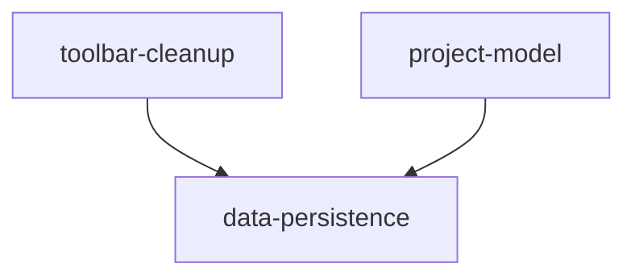

# DAG 任务图: 录制数据持久化与编辑器工具栏精简

**日期:** 2026-07-15

## 依赖图

## 任务列表

### Batch 1（无依赖，可并行）

| Task ID | Slug | 标题 | 类型 | 涉及模块 | 预估工时 |
|---------|------|------|------|----------|----------|
| T1 | toolbar-cleanup | 编辑器工具栏移除录制/停止按钮 | frontend | app/main_window.py | 0.5h |
| T2 | project-model | Project 模型新增 cursor_events 等字段 | backend | core/project.py | 0.5h |

### Batch 2（依赖 Batch 1）

| Task ID | Slug | 标题 | 类型 | 依赖 | 涉及模块 | 预估工时 |
|---------|------|------|------|------|----------|----------|
| T3 | data-persistence | 实现完整的保存/恢复链路 | fullstack | T1, T2 | app/main_window.py | 2h |

## 循环依赖检查
✅ 未检测到循环依赖
