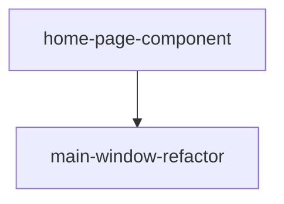

# DAG 任务图: Recordly 交互与页面架构重构

**日期:** 2026-07-15

## 依赖图

## 任务列表

### Batch 1（无依赖，可并行）

| Task ID | Slug | 标题 | 类型 | 涉及模块 | 预估工时 |
|---------|------|------|------|----------|----------|
| T1 | home-page-component | 创建 HomePage 首页组件 | frontend | ui/home_page.py | 1.5h |

### Batch 2（依赖 Batch 1）

| Task ID | Slug | 标题 | 类型 | 依赖 | 涉及模块 | 预估工时 |
|---------|------|------|------|------|----------|----------|
| T2 | main-window-refactor | 重构 MainWindow 双页架构与交互流程 | fullstack | T1 | app/main_window.py | 3h |

## 任务详情

### T1: 创建 HomePage 首页组件
- **Slug:** home-page-component
- **类型:** frontend
- **依赖:** 无
- **涉及模块:** ui/home_page.py
- **描述:**
  创建 `ui/home_page.py`，实现 `HomePage(QWidget)` 组件：
  - 顶部区域：标题 "Recordly" + 两个操作按钮（"🎬 开始录制"、"📂 打开项目"）
  - 下方区域：嵌入 `ProjectGallery`，展示所有项目卡片
  - 信号定义：`record_requested`、`open_project_requested`、`project_opened(str)`
  - `refresh_projects()` 公共方法
  - 暗色主题样式（与现有风格一致）
  - 空项目状态引导文案
- **验收标准:**
  - [ ] `HomePage` 可独立实例化，显示操作按钮和项目画廊
  - [ ] 三个信号正确发射：record_requested、open_project_requested、project_opened
  - [ ] `refresh_projects()` 调用 `ProjectGallery.refresh()`
  - [ ] 暗色主题样式与现有界面风格一致
- **输出文件:** `ui/home_page.py`
- **关联用户故事:** US-1, US-2

### T2: 重构 MainWindow 双页架构与交互流程
- **Slug:** main-window-refactor
- **类型:** fullstack
- **依赖:** T1
- **涉及模块:** app/main_window.py
- **描述:**
  重构 `MainWindow`，将原有的"编辑器 ↔ 项目文件"双页改为"首页 → 编辑器"双页架构：
  1. **双页架构** — `_stacked_widget` 包含首页 (index 0) 和编辑器 (index 1)，默认显示首页
  2. **菜单栏** — 移除"视图"菜单，"文件"菜单按页面动态调整
  3. **工具栏** — 首页隐藏 `_toolbar`，编辑器显示
  4. **录制流程** — 点击首页"开始录制"→ 确认弹窗 → 最小化窗口 → 开始录制 → 停止录制 → ExportWorker 导出 → 自动创建项目 → **自动切换到编辑器** → 恢复窗口
  5. **首页交互** — 首页按钮连接：开始录制、打开项目（文件选择器）、点击项目卡片进入编辑器
  6. **返回首页** — 编辑器菜单"返回首页"切换到首页并刷新项目列表
  7. **初始化顺序** — 确保 HomePage 在 MainWindow._setup_navigation 之前可用
- **验收标准:**
  - [ ] 启动后默认显示首页，工具栏不可见
  - [ ] 首页点击"开始录制"弹出确认对话框
  - [ ] 确认后窗口最小化，开始录制
  - [ ] 停止录制后自动创建项目并切换到编辑器，工具栏可见
  - [ ] 首页点击项目卡片切换到编辑器
  - [ ] 编辑器菜单"返回首页"切换到首页，项目列表已刷新
  - [ ] 编辑器菜单"文件→导出"功能正常
  - [ ] 工具栏所有按钮功能正常（录制/播放/导出/裁剪/音频）
  - [ ] 菜单栏在首页和编辑器页面显示正确的菜单项
- **输出文件:** `app/main_window.py`
- **关联用户故事:** US-1, US-2, US-3, US-4

## 循环依赖检查
✅ 未检测到循环依赖
