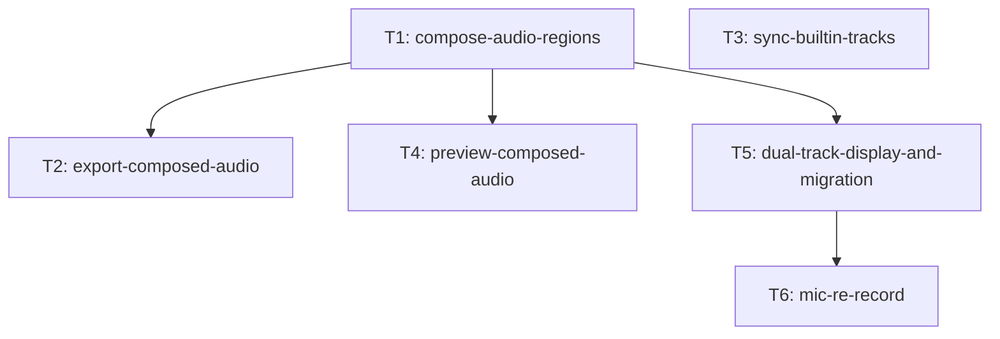

# 双音频轨道编辑与麦克风补录 — Task DAG

## 输入

- Parent Issue: #125
- PRD: `docs/prd/recordly-dual-audio-tracks-and-re-record.md`
- Spec: `docs/dev/specs/recordly-dual-audio-tracks-and-re-record.md`
- ADR: `docs/adr/2026-08-10-dual-audio-tracks-re-record.md`

## 拆分结论

共 6 个单人任务，按三层依赖布局：

1. **数据/合成核心（无依赖）**：T1（compose_audio 合成 + read_wav 提升）、T3（三轨 sync）。
2. **导出/预览接线（依赖 T1）**：T2（导出走 compose_audio + extra_audio 改名）、T4（预览走 compose_audio）、T5（双轨展示 + 旧项目补齐 + 波形按轨）。
3. **UI/补录（依赖 T5）**：T6（录音窗口 + CompositeCommand 补录 + 零残留）。



## 拓扑顺序

```text
T1, T3 → T2, T4, T5 → T6
```

- 第 1 层（可并行）：T1、T3
- 第 2 层（依赖 T1，可并行）：T2、T4、T5
- 第 3 层（依赖 T5）：T6

## 文件冲突说明（非 blocking，但影响并行排期）

| 任务 | 生产文件 | 测试文件 |
|---|---|---|
| T1 | `core/audio_mix.py`（新）、`core/audio_capture.py`、`app/main_window.py`（_read_wav 段） | `tests/test_audio_mix.py`（新）、`tests/test_audio_capture.py` |
| T2 | `core/exporter.py`、`app/export_controller.py`、`app/main_window.py`（导出链段） | `tests/test_exporter.py`、`tests/test_export_controller.py` |
| T3 | `app/main_window.py`（_on_clips_changed 段） | `tests/test_project.py`、`tests/test_main_window.py` |
| T4 | `ui/preview_widget.py`、`app/main_window.py`（_create_playback_controller 音频段） | `tests/test_preview_widget.py` |
| T5 | `app/main_window.py`（_populate_timeline/_restore_timeline/_create_playback_controller provider 段）、`ui/timeline.py` | `tests/test_main_window.py`、`tests/test_timeline.py` |
| T6 | `ui/record_audio_dialog.py`（新）、`ui/timeline.py`（右键菜单段）、`app/main_window.py` | `tests/test_record_audio_dialog.py`（新）、`tests/test_commands.py`、`tests/test_timeline.py`、`tests/test_main_window.py` |

- T2 / T3 / T4 / T5 共享 `app/main_window.py` 但修改不同方法（T4 与 T5 同改 `_create_playback_controller` 的不同段）——不构成真实 blocking；并行执行时后合入者 rebase 即可。T2 与 T4 与 T5 都依赖 T1（compose_audio / core.read_wav），第 2 层须在 T1 之后。
- T5 与 T6 共享 `ui/timeline.py`（T5 改 TRACK_COLORS/_can_drop_to_track/_draw_audio_waveform，T6 改右键菜单段）——T6 已声明依赖 T5（补录闭环复用双轨恢复链路，用户约束）。

## DAG 校验

- 节点：T1–T6，共 6 个。
- 边：T1→T2、T1→T4、T1→T5、T5→T6。
- Kahn 拓扑排序可消费全部 6 个节点（T1、T3 入度 0 起步），结论：**无环**。

## 假设与边界

1. 每个 Task 完成时仓库可工作：T3 的 regions 为内部状态，T2/T4 未合入时无 UI 回归；T2/T4 的合成语义在 T1 之后即可独立验证（构造 regions 直测，不经 T3）。
2. 全部 AC 来自方案 §9 Testing Decisions 的 Observable Result；Test Seam 均为既有或方案已定义的公共接口，无新增 Seam。
3. 实现 PR 以 `feat/<task-slug>` 分支发起，PR body 使用 `Closes #<Sub Issue>`；不得直接 push `master`。
