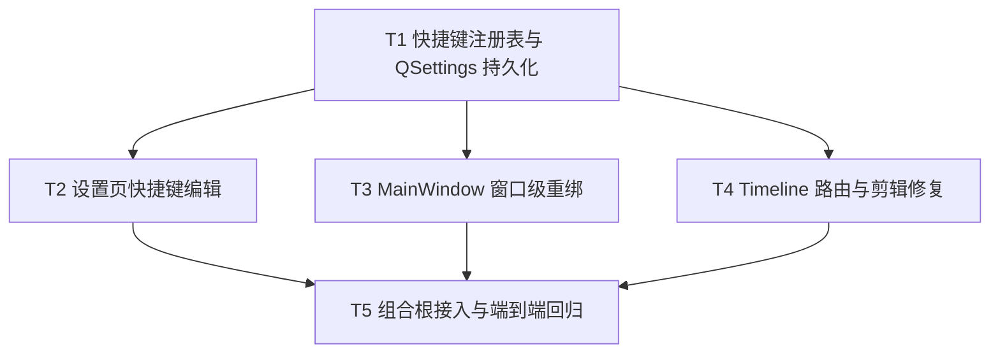

# 编辑器可用性修复与快捷键配置 — 实施 DAG

**关联：** Parent Issue #105、`docs/dev/specs/recordly-editor-usability-fixes.md`、`docs/adr/2026-07-19-editor-shortcut-registry.md`

## DAG

## 拓扑 Batch

| Batch | 任务 | 建议 agent | 可并行性 | 前置条件 | 交付物 |
|---|---|---|---|---|---|
| 1 | T1 | backend | 1 | 无 | 纯 Python 注册表、`AppConfig.shortcuts`、QSettings 测试。 |
| 2 | T2 | frontend | 3 | T1 | 设置草稿、捕获、冲突、恢复默认和设置 GUI 测试。 |
| 2 | T3 | frontend | 3 | T1 | 窗口级 `QShortcut` 重绑、焦点守卫与动态提示测试。 |
| 2 | T4 | frontend | 3 | T1 | Timeline 注册表路由、音频切割、右段选择/拖动与 nudge 回归。 |
| 3 | T5 | frontend | 1 | T2、T3、T4 | 共享注册表组合根接线、重启持久化端到端测试和手工验收记录。 |

## 并行边界与组合策略

技术方案建议的 `T1 → {T2, T3, T4} → T5` 保持不变。为使 Batch 2 每项可在独立 worktree 中通过自身测试：

- T2 保持 `SettingsDialog(config, parent)` 现有构造契约，只在保存后更新 `config.shortcuts`。
- T3 只处理 MainWindow 的窗口级动作和共享注册表，不依赖 Timeline 新 API。
- T4 在 Timeline 内提供带默认值的 `set_shortcut_registry()`，不反向依赖 MainWindow 或 QSettings。
- T5 是唯一的组合根任务：将 T3 的同一注册表传给 T4，避免并行任务引入接口时序或循环依赖。

此拆分不改变 ADR 的最终架构：运行时只有一个由 MainWindow 拥有的注册表，窗口级与时间线级均从它读取。

## 任务索引

| ID | 文档 | Issue | 类型 | 预估 |
|---|---|---:|---|---:|
| T1 | `T1-shortcut-registry-persistence.md` | [#106](https://github.com/devcxl/recordly/issues/106) | backend | 3h |
| T2 | `T2-settings-shortcut-editor.md` | [#107](https://github.com/devcxl/recordly/issues/107) | frontend | 4h |
| T3 | `T3-mainwindow-window-shortcut-rebinding.md` | [#108](https://github.com/devcxl/recordly/issues/108) | frontend | 3h |
| T4 | `T4-timeline-configurable-shortcuts-and-clip-fixes.md` | [#109](https://github.com/devcxl/recordly/issues/109) | frontend | 4h |
| T5 | `T5-editor-shortcut-integration-regression.md` | [#110](https://github.com/devcxl/recordly/issues/110) | frontend | 3h |

## 不变量与范围守卫

- 不修改 `SplitClipCommand`、`MoveClipCommand` 数据结构、项目 JSON、导出管线或快捷键以外的应用行为。
- Timeline action 保持 widget 焦点边界；窗口 action 保持 `WindowShortcut` 和 `_is_editor_active_and_safe()` 守卫。
- 普通音频切割的验收范围仅限 Timeline source/undo/redo 正确；导出语义风险 R1 不在本 DAG 内。
