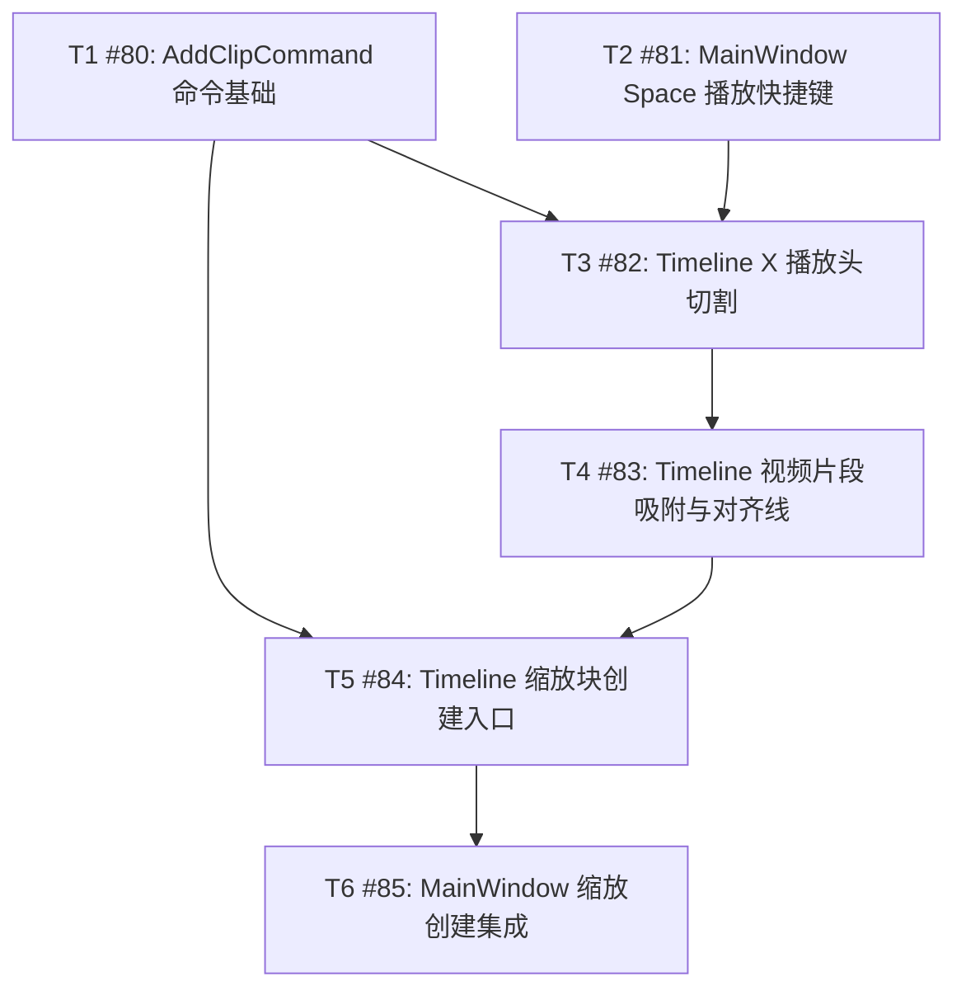

# 时间线编辑器交互增强 — Phase 2 任务 DAG

## 输入

- Parent Issue: [#78](https://github.com/devcxl/recordly/issues/78)
- PRD: `docs/prd/recordly-timeline-interaction-enhancements.md`
- Spec: `docs/dev/specs/recordly-timeline-interaction-enhancements.md`
- ADR: `docs/adr/2026-07-19-timeline-interaction-routing-and-snapping.md`

## 拆分结论

共 6 个单人任务，每项预计 1–2 小时。T1 与 T2 修改的生产文件和测试文件均不重叠，可并行；后续任务按共享文件串行，避免 `ui/timeline.py`、`app/main_window.py`、`tests/test_timeline.py`、`tests/test_main_window.py` 产生并行冲突。



## Batch 执行计划

| Batch | 可并行任务 | 前置条件 | 文件冲突说明 |
|---|---|---|---|
| 1 | T1、T2 | 无 | 两项生产文件、测试文件均不重叠 |
| 2 | T3 | T1、T2 | 等待两个共享测试/生产文件基线合入 |
| 3 | T4 | T3 | 与 T3 共享 `ui/timeline.py`、`tests/test_timeline.py` |
| 4 | T5 | T1、T4 | 复用 AddClipCommand，并承接 Timeline 文件基线 |
| 5 | T6 | T5 | 最终串联 MainWindow、命令栈与 ZoomOverlay |

## 拓扑顺序

唯一按任务编号表达的稳定拓扑顺序：

```text
T1, T2, T3, T4, T5, T6
```

其中 T1、T2 可交换执行；其余任务按依赖顺序执行。

## 文件所有权

| 任务 | 生产文件 | 测试文件 |
|---|---|---|
| T1 | `core/commands.py` | `tests/test_timeline.py` |
| T2 | `app/main_window.py` | `tests/test_main_window.py` |
| T3 | `ui/timeline.py`、`app/main_window.py` | `tests/test_timeline.py`、`tests/test_main_window.py` |
| T4 | `ui/timeline.py` | `tests/test_timeline.py` |
| T5 | `ui/timeline.py` | `tests/test_timeline.py` |
| T6 | `app/main_window.py` | `tests/test_main_window.py`；仅回归 `tests/test_preview_widget.py` |

禁止修改 `core/project.py`、`ui/preview_widget.py`、持久化 schema、合成器或导出管线。

## DAG 校验

- 节点：T1–T6，共 6 个。
- 边：T1→T3、T2→T3、T3→T4、T1→T5、T4→T5、T5→T6。
- Kahn 拓扑排序可消费全部 6 个节点，剩余入度节点为 0，结论：**无环**。
- GitHub Parent #78 的 Sub Issues 已通过 GraphQL `subIssues` 查询验证为 #80–#85。

## 假设与边界

1. T3 对 T1/T2 的依赖同时承担共享测试文件和 MainWindow 文件的交付串行化；X 的业务逻辑仍复用现有 `SplitClipCommand`。
2. T5 只交付 Timeline 入口和命令接口，T6 负责完整用户链路串联；这样每项保持在 1–2 小时内。
3. 所有实现 PR 必须以对应任务分支发起，PR body 使用 `Closes #<Sub Issue>`；不得直接 push `master`。
