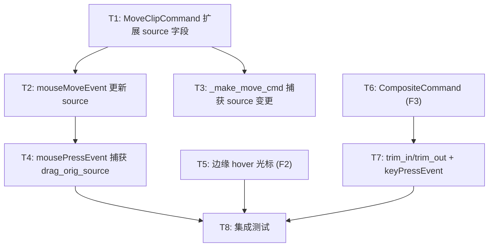

# 时间线裁剪功能 — 任务清单

## DAG

## Batch 执行计划

| Batch | 任务 | 并行度 | 依赖 |
|-------|------|--------|------|
| 1 | T1, T5, T6 | 3 | 无 |
| 2 | T2, T3 | 2 | T1 |
| 3 | T4, T7 | 2 | T2, T6 |
| 4 | T8 | 1 | T4, T5, T7 |

## 文件影响范围

所有任务仅涉及两个文件：
- `core/commands.py` — T1, T6
- `ui/timeline.py` — T2, T3, T4, T5, T7, T8
